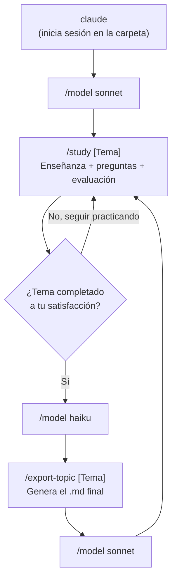

# 🖥️ Guía: Study Mode en Claude Code (con ahorro de tokens)

**Objetivo:** Replicar el flujo de coaching que hemos usado en claude.ai, pero corriendo localmente en tu terminal con Claude Code, alternando modelos para ahorrar costo: **Sonnet** para enseñanza/evaluación, **Haiku** para generación mecánica de archivos.

---

## 1️⃣ Instalación (si aún no la tienes)

```bash
npm install -g @anthropic-ai/claude-code
```

Verifica:
```bash
claude --version
```

---

## 2️⃣ Estructura del proyecto

Crea una carpeta dedicada a tu PlayBook y entra ahí:

```bash
mkdir -p ~/DotNetInterviewPrep/PlayBook
cd ~/DotNetInterviewPrep/PlayBook
```

Estructura recomendada:

```text
PlayBook/
├── CLAUDE.md                  <- Contexto persistente (se lee automático cada sesión)
├── .claude/
│   └── skills/
│       ├── study/
│       │   └── SKILL.md       <- Comando /study (modo enseñanza)
│       └── export-topic/
│           └── SKILL.md       <- Comando /export-topic (modo generación de archivo)
├── 01-Interfaces.md
├── 02-AbstractClasses.md
├── ...
└── 00-Roadmap-Status.md       <- Tu tracker de progreso
```

---

## 3️⃣ El archivo `CLAUDE.md` (contexto persistente)

Este archivo se lee **automáticamente** cada vez que abres una sesión de Claude Code en esta carpeta — no tienes que volver a explicar el contexto nunca más.

```bash
cat > CLAUDE.md << 'EOF'
# Contexto: Senior .NET Interview Prep

## Rol
Actúas como Senior/Staff .NET Engineer y Coach de entrevistas técnicas.
Sé exigente, no generoso con los scores. No aceptes respuestas vagas o genéricas.

## Formato de enseñanza (Study Mode)
1. Explica el concepto en **español**, con ritmo pausado y ejemplos pedagógicos simples
   (analogías antes de código cuando el tema sea abstracto).
2. Usa el dominio **Dental Clinic** (Patient, Dentist, Appointment, Odontogram) como
   ejemplo recurrente en TODOS los temas.
3. Da un ejemplo de código C# concreto y correcto.
4. Incluye un diagrama Mermaid cuando ayude a visualizar relaciones/flujo.
5. Termina SIEMPRE con UNA pregunta de práctica, y espera mi respuesta antes de continuar.
6. Al evaluar mi respuesta: da un Score (1-10) honesto, explica qué faltó específicamente,
   y cierra con la Respuesta Senior en INGLÉS lista para entrevista real.

## Dominio de referencia
- Patient, Dentist: agregados independientes (NO heredan de una clase Person compartida)
- Value Objects: PersonName, ContactInfo (records inmutables)
- Appointment, Odontogram como entidades relacionadas

## Reglas
- No expliques como "nivel Arquitecto" por defecto — soy Senior, ajusta el tono si lo pido.
- No avances de tema hasta que yo lo indique explícitamente.
- Sé directo, sin relleno innecesario.
EOF
```

---

## 4️⃣ Skill `/study` — Modo enseñanza (usa Sonnet)

```bash
mkdir -p .claude/skills/study
cat > .claude/skills/study/SKILL.md << 'EOF'
---
name: study
description: Inicia o continúa una sesión de Study Mode para un tema de la lista de entrevista Senior .NET
---

# Study Mode

Recibe el nombre de un tema (ej: "Interfaces", "Dependency Inversion", "Virtual Override Overload").

Sigue exactamente el formato de enseñanza definido en CLAUDE.md para ese tema.
Si ya se discutió antes en esta sesión, continúa desde donde se quedó en lugar de repetir desde cero.
EOF
```

Uso:
```bash
claude
/model sonnet
/study Interfaces
```

---

## 5️⃣ Skill `/export-topic` — Generar archivo del tema (usa Haiku)

```bash
mkdir -p .claude/skills/export-topic
cat > .claude/skills/export-topic/SKILL.md << 'EOF'
---
name: export-topic
description: Genera el archivo .md final de un tema ya completado, con el formato del PlayBook
---

# Export Topic

Toma el tema recién discutido en esta conversación y genera un archivo .md con esta estructura:

1. Título y dominio de referencia
2. Concepto (resumen breve)
3. Problema que resuelve (con código "malo" de ejemplo)
4. Solución (con código correcto)
5. Diagrama Mermaid
6. Trade-offs (tabla)
7. Respuesta Senior en inglés (la ya generada en la conversación)
8. Puntos clave para recordar (bullets)

Guarda el archivo como `NN-NombreDelTema.md` (numeración secuencial según el roadmap)
en la raíz del proyecto. No inventes contenido nuevo — usa exactamente lo ya discutido
en esta sesión.
EOF
```

Uso (cambiando a Haiku justo antes, porque es tarea mecánica de formato):
```bash
/model haiku
/export-topic Interfaces
```

Después de generar el archivo, regresa a Sonnet para el siguiente tema:
```bash
/model sonnet
/study Abstract Classes
```

---

## 6️⃣ Flujo de trabajo recomendado (resumen)



---

## 7️⃣ Rastrear tu gasto de tokens

Después de cada sesión o cambio de modelo:

```bash
/cost
```

Esto te muestra el consumo de tokens/costo actual — útil para confirmar que alternar Sonnet/Haiku realmente está ahorrando frente a usar Sonnet todo el tiempo.

---

## 8️⃣ Tip: fijar Sonnet como default

Ya que la mayoría del tiempo real de valor está en la enseñanza (Sonnet), puedes fijarlo como modelo por defecto al abrir Claude Code, y solo bajar a Haiku manualmente cuando toque exportar:

```bash
export ANTHROPIC_MODEL=sonnet
```//
Agrega esa línea a tu `~/.zshrc` o `~/.bashrc` para que sea permanente.

---

## 📝 Notas

- El contexto de `CLAUDE.md` se aplica automáticamente en cada sesión nueva dentro de esta carpeta — no necesitas repetir "explícame en español, dame la respuesta en inglés" cada vez.
- Cambiar de modelo con `/model` **no pierde el hilo de la conversación** — el modelo nuevo ve todo lo discutido antes.
- Si un tema requiere mucho ida y vuelta (como pasó con Interfaces/Abstract Classes en nuestra sesión), quédate en Sonnet todo ese tiempo — el ahorro real está en no usar Sonnet para la parte mecánica de generar el archivo final.
