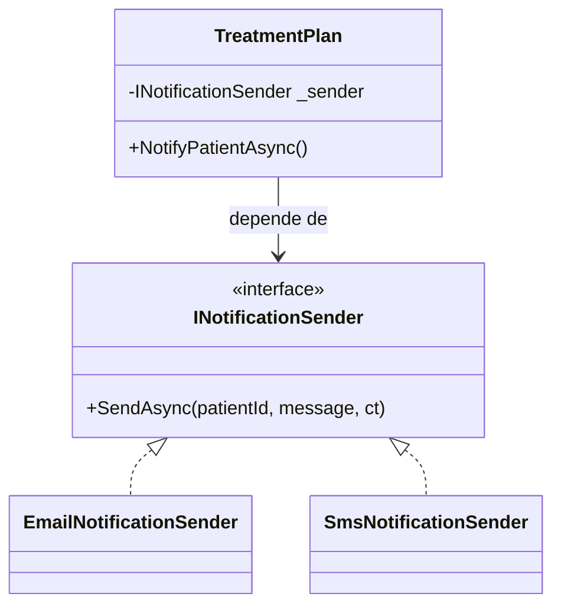

# 🧩 Tema 1: Interfaces

**Dominio de referencia:** Dental Clinic

---

## 🎯 Concepto

Una interfaz define un **contrato de comportamiento**: qué métodos/propiedades debe exponer una clase, sin decir *cómo* los implementa. No tiene estado (campos), no tiene lógica — solo la firma.

> Es como un enchufe de pared: cualquier aparato con la clavija correcta puede conectarse, sin importar qué tan distinto sea internamente.

---

## ❌ Problema que resuelve

Sin interfaz, una clase queda acoplada a una implementación concreta:

```csharp
public class TreatmentPlan
{
    private EmailSender _emailSender;  // ⚠️ Depende de UNA implementación concreta

    public TreatmentPlan()
    {
        _emailSender = new EmailSender();  // Acoplado fuertemente a Email
    }

    public void NotifyPatient(Guid patientId, string message)
    {
        _emailSender.Send(patientId, message);  // Solo Email, nada más
    }
}
```

**Problemas concretos:**
1. **Rigidez:** agregar SMS obliga a modificar `TreatmentPlan` (viola Open/Closed).
2. **Imposible de testear sin efectos secundarios:** el test enviaría un email real.
3. **Acoplamiento fuerte:** `TreatmentPlan` conoce detalles internos de `EmailSender`.

---

## ✅ Solución con interfaz

```csharp
public interface INotificationSender
{
    Task SendAsync(Guid patientId, string message, CancellationToken ct);
}

public class EmailNotificationSender : INotificationSender
{
    public async Task SendAsync(Guid patientId, string message, CancellationToken ct)
    {
        Console.WriteLine($"✉️ Email enviado a paciente {patientId}");
    }
}

public class SmsNotificationSender : INotificationSender
{
    public async Task SendAsync(Guid patientId, string message, CancellationToken ct)
    {
        Console.WriteLine($"📱 SMS enviado a paciente {patientId}");
    }
}

public class TreatmentPlan
{
    private readonly INotificationSender _sender;  // ✅ Depende de interfaz

    public TreatmentPlan(INotificationSender sender)
    {
        _sender = sender; // Inyectado — no importa cuál implementación sea
    }

    public async Task NotifyPatientAsync(Guid patientId, string message, CancellationToken ct)
    {
        await _sender.SendAsync(patientId, message, ct);
    }
}
```

Registro en DI (`Program.cs`):

```csharp
services.AddScoped<INotificationSender, EmailNotificationSender>();  // Hoy: Email
// services.AddScoped<INotificationSender, SmsNotificationSender>(); // Mañana: SMS
```

Ningún cambio en `TreatmentPlan` al agregar canales nuevos.

---

## 📊 Diagrama



---

## 🧪 Por qué esto importa para Testing (el detalle técnico clave)

**Sin interfaz** — el test ejecuta código SMTP real:

```csharp
[Fact]
public async Task NotifyPatientAsync_ShouldSendMessage()
{
    var treatmentPlan = new TreatmentPlan(); // usa EmailNotificationSender real
    await treatmentPlan.NotifyPatientAsync(patientId, "Test message", CancellationToken.None);
    // Se ejecutó código SMTP real: lento, inestable, depende de infraestructura externa.
}
```

**Con interfaz** — se puede mockear:

```csharp
[Fact]
public async Task NotifyPatientAsync_ShouldCallSenderWithCorrectMessage()
{
    var mockSender = new Mock<INotificationSender>();
    var treatmentPlan = new TreatmentPlan(mockSender.Object);

    await treatmentPlan.NotifyPatientAsync(patientId, "Tu cita fue confirmada", CancellationToken.None);

    mockSender.Verify(s => s.SendAsync(patientId, "Tu cita fue confirmada", It.IsAny<CancellationToken>()), Times.Once);
}
```

**Mecanismo técnico exacto:** un mocking framework (Moq) genera un **dynamic proxy** en tiempo de ejecución. Con una interfaz, cualquier clase nueva puede implementarla libremente. Con una clase concreta, Moq tendría que generar una subclase y hacer `override` de sus métodos — algo que **solo es posible si esos métodos son `virtual` o `abstract`**. Un método normal (no-virtual) en una clase concreta es, en la práctica, **inmockeable**.

---

## ⚖️ Trade-offs

| Ventajas | Desventajas |
|---|---|
| Desacoplamiento | Indirección extra si es innecesaria |
| Extensible (Open/Closed) | Riesgo de sobre-ingeniería si se abusa |
| Testeable (mockeable) | — |

---

## 🎤 Respuesta Senior (English)

> "An interface defines a behavioral contract without dictating implementation, which lets consuming code depend on an abstraction rather than a concrete class. In the dental clinic system, `TreatmentPlan` depends on `INotificationSender` instead of a specific `EmailNotificationSender`, so I can introduce new notification channels — SMS, WhatsApp — without modifying or recompiling the service that consumes them. This directly supports the Open/Closed Principle and makes the class trivially testable, since I can substitute a mock implementation in unit tests. Technically, this is only possible because mocking frameworks generate dynamic proxies — they can implement any interface freely, but can't override non-virtual methods on a concrete class."

---

## 📝 Puntos clave para recordar

- Interfaz = contrato sin estado ni lógica.
- Habilita desacoplamiento + testabilidad real (mocking).
- El mocking funciona con interfaces porque un dynamic proxy puede implementar cualquier interfaz libremente, pero no puede sobrescribir métodos no-virtuales de una clase concreta.
