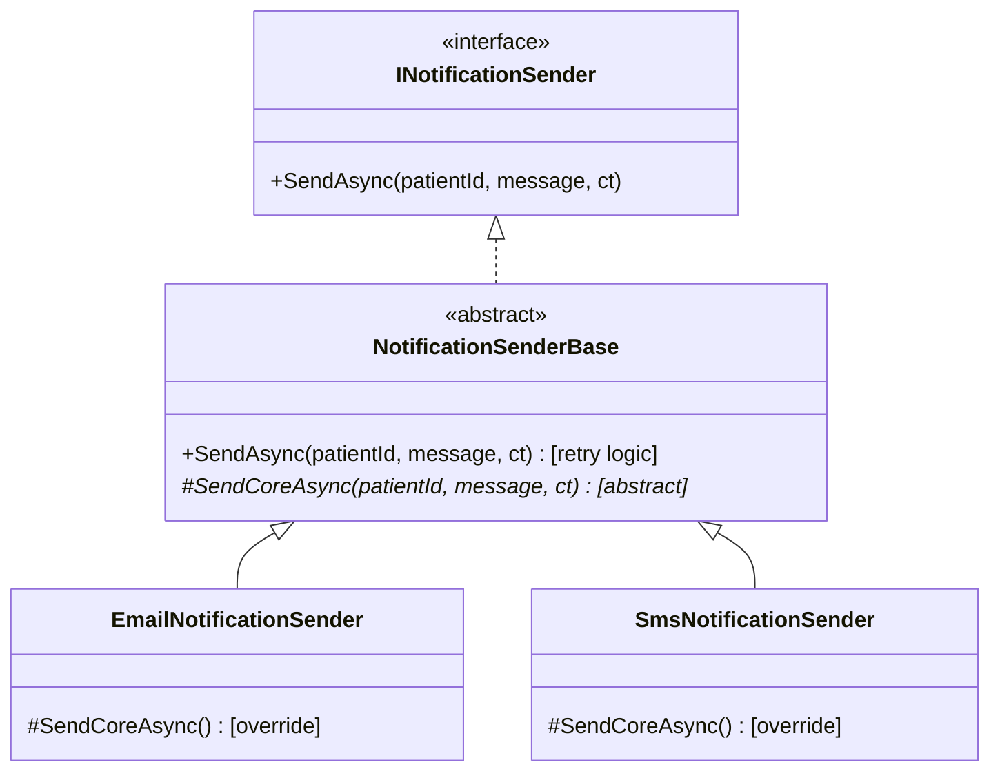

# 🧩 Tema 2: Abstract Classes

**Dominio de referencia:** Dental Clinic

---

## 🎯 Concepto

Una **clase abstracta**:
- **No se puede instanciar directamente** (`new AbstractClass()` es error de compilación).
- Puede tener **métodos con implementación completa** (código real compartido).
- Puede tener **métodos abstractos** (`abstract`) — sin cuerpo, obligatorios para las hijas.
- Puede tener **estado** (campos, propiedades) — a diferencia de una interfaz.

> Es como un "cargador universal": ya trae la lógica común resuelta (regular voltaje), y cada dispositivo específico solo declara lo que le hace único.

---

## ❌ Problema que resuelve

`EmailNotificationSender` y `SmsNotificationSender` necesitan la misma lógica de reintentos. Solo con interfaces, el código se duplica:

```csharp
// ❌ Código duplicado
public class EmailNotificationSender : INotificationSender
{
    public async Task SendAsync(Guid patientId, string message, CancellationToken ct)
    {
        for (int attempt = 1; attempt <= 3; attempt++)
        {
            try { await SendEmailInternal(patientId, message, ct); return; }
            catch when (attempt < 3) { await Task.Delay(1000, ct); }
        }
    }
}

public class SmsNotificationSender : INotificationSender
{
    public async Task SendAsync(Guid patientId, string message, CancellationToken ct)
    {
        for (int attempt = 1; attempt <= 3; attempt++)  // ⚠️ MISMO código repetido
        {
            try { await SendSmsInternal(patientId, message, ct); return; }
            catch when (attempt < 3) { await Task.Delay(1000, ct); }
        }
    }
}
```

---

## ✅ Solución: Template Method Pattern con clase abstracta

```csharp
public abstract class NotificationSenderBase : INotificationSender
{
    private const int MaxAttempts = 3;

    // MÉTODO CONCRETO — compartido por TODAS las hijas, escrito UNA sola vez
    public async Task SendAsync(Guid patientId, string message, CancellationToken ct)
    {
        for (int attempt = 1; attempt <= MaxAttempts; attempt++)
        {
            try
            {
                await SendCoreAsync(patientId, message, ct); // delega el paso específico
                return;
            }
            catch (Exception ex) when (attempt < MaxAttempts)
            {
                Console.WriteLine($"Intento {attempt} falló: {ex.Message}. Reintentando...");
                await Task.Delay(1000, ct);
            }
        }
    }

    // MÉTODO ABSTRACTO — sin cuerpo, OBLIGA a cada hija a implementarlo
    protected abstract Task SendCoreAsync(Guid patientId, string message, CancellationToken ct);
}

public class EmailNotificationSender : NotificationSenderBase
{
    protected override Task SendCoreAsync(Guid patientId, string message, CancellationToken ct)
    {
        Console.WriteLine($"✉️ Enviando email a paciente {patientId}");
        return Task.CompletedTask;
    }
}

public class SmsNotificationSender : NotificationSenderBase
{
    protected override Task SendCoreAsync(Guid patientId, string message, CancellationToken ct)
    {
        Console.WriteLine($"📱 Enviando SMS a paciente {patientId}");
        return Task.CompletedTask;
    }
}
```

```csharp
// var sender = new NotificationSenderBase(); // ❌ ERROR: no se puede instanciar
var sender = new EmailNotificationSender();     // ✅ OK
```

**Nota clave:** la clase abstracta sigue implementando la interfaz. La interfaz define el contrato externo; la clase abstracta define la implementación compartida interna. No son excluyentes.

---

## 📊 Diagrama



---

## ⚖️ Trade-offs

| Ventajas | Desventajas |
|---|---|
| Elimina duplicación real de código | Herencia simple: solo una clase base por hija |
| Centraliza cambios de comportamiento compartido | Acopla a las hijas a una jerarquía rígida (Fragile Base Class) |
| Combina bien con interfaces (no son excluyentes) | No todas las implementaciones futuras necesitan heredar de ella |

---

## 🎤 Respuesta Senior (English)

> "An abstract class lets me share real, concrete implementation across related classes while still forcing each subclass to provide its own specific behavior through abstract methods. In the dental clinic notification system, `NotificationSenderBase` implements the retry logic exactly once using the Template Method pattern, while `EmailNotificationSender` and `SmsNotificationSender` only override the piece that's actually different — how the message physically gets sent. This differs from an interface: an interface defines *what* must be done with no shared code, while an abstract class defines *what must be done differently* alongside *what should behave identically* across implementations."

---

## 📝 Puntos clave para recordar

- Clase abstracta = identidad compartida + comportamiento real compartido.
- Template Method Pattern: el método concreto orquesta, el método abstracto delega el paso variable.
- Puede (y suele) implementar una interfaz al mismo tiempo — no son mutuamente excluyentes.
- Herencia simple en C#: limita cuántas clases abstractas puede heredar una hija (solo una).
