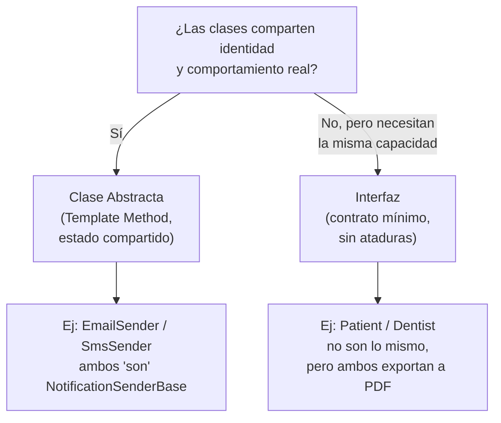

# 🧩 Tema 3: Interface vs Abstract Class

**Dominio de referencia:** Dental Clinic

---

## 🎯 La tabla comparativa

| | Interfaz | Clase Abstracta |
|---|---|---|
| ¿Puede tener código real (lógica)? | ❌ No (salvo default members, Tema 7) | ✅ Sí |
| ¿Puede tener estado (campos/variables)? | ❌ No | ✅ Sí |
| ¿Cuántas puede "heredar" una clase? | Muchas (implementa varias interfaces) | Solo una |
| ¿Qué representa? | "Puede hacer esto" (capacidad) | "Es un tipo de esto" (identidad compartida) |
| ¿Se puede instanciar? | ❌ Nunca | ❌ Tampoco, pero sus hijas sí |

---

## 🧠 La pregunta real detrás de la tabla

Un entrevistador Senior no quiere que recites la tabla — quiere ver cómo **decides**. La pregunta correcta:

> **¿Qué tan relacionadas están las clases entre sí?**

- Si dos clases **comparten identidad y comportamiento real** → clase abstracta.
- Si dos clases **no tienen relación alguna, pero ambas necesitan poder hacer lo mismo desde afuera** → interfaz.

---

## 🦷 ¿Por qué NO usamos una clase abstracta `NotificationSenderBase` para todo?

Ya vimos en el Tema 2 que `EmailNotificationSender` y `SmsNotificationSender` comparten identidad (ambos son "enviadores con retry"). Pero, ¿qué pasa con un tercer caso: `PushNotificationSender`, cuyo SDK ya maneja sus propios reintentos?

```csharp
// Con solo la clase abstracta, quedaría FORZADO a heredar retry que no necesita:
public class PushNotificationSender : NotificationSenderBase  // ⚠️ hereda retry innecesario
{
    protected override Task SendCoreAsync(...) { /* el SDK ya reintenta solo */ }
}

// Con la interfaz, tiene libertad total:
public class PushNotificationSender : INotificationSender  // ✅ contrato limpio, sin ataduras
{
    public Task SendAsync(Guid patientId, string message, CancellationToken ct)
        => _pushSdk.SendAsync(patientId, message, ct);
}
```

**Por eso `TreatmentPlan` sigue dependiendo de `INotificationSender`, no de `NotificationSenderBase`:** la interfaz es el contrato mínimo. La clase abstracta es una ayuda opcional, no obligatoria, para quien comparte esa forma específica de resolver el problema.

---

## 🦷 Ejemplo con Patient y Dentist

`Patient` y `Dentist` — según el Módulo 1 del playbook original — **no son subclases entre sí**. Son **agregados independientes** (por eso se rechazó una clase abstracta `Person` desde el principio: TPH genera columnas NULL, TPT fuerza JOINs).

Pero ambos necesitan la misma **capacidad**: exportarse a PDF.

```csharp
public interface IExportableProfile
{
    byte[] ExportProfileToPdf();
}

public class Patient : IExportableProfile
{
    public byte[] ExportProfileToPdf()
    {
        // nombre, historial médico, odontograma...
    }
}

public class Dentist : IExportableProfile
{
    public byte[] ExportProfileToPdf()
    {
        // nombre, cédula profesional, especialidad...
    }
}
```

No hay identidad compartida entre `Patient` y `Dentist` — solo una capacidad compartida. Por eso: **interfaz, no clase abstracta.**

---

## 📊 Diagrama de decisión



---

## ⚖️ Regla simple para recordar

> **"¿Estas clases son básicamente lo mismo con pequeñas variaciones?" → clase abstracta.**
> **"¿Estas clases son completamente distintas, pero necesito que todas puedan hacer X?" → interfaz.**

---

## 🎤 Respuesta Senior (English)

> "I choose between an interface and an abstract class based on relationship, not just syntax. If two classes are fundamentally the same kind of thing and share real implementation — like `EmailNotificationSender` and `SmsNotificationSender`, which both need identical retry logic — an abstract class avoids duplicating that behavior. But if classes are unrelated in identity and only need to share a capability — like `Patient` and `Dentist`, which are independent aggregates in our domain but both need to export a PDF profile — an interface is the right tool, because it expresses 'can do X' without forcing an artificial shared ancestor. I also keep consuming code depending on interfaces rather than abstract classes whenever possible, since that keeps the contract minimal and avoids forcing every future implementation into a specific inheritance hierarchy it may not need."

---

## 📝 Puntos clave para recordar

- La decisión no es sintáctica, es sobre **relación entre las clases**.
- Clase abstracta: identidad + comportamiento compartido real.
- Interfaz: capacidad compartida, sin importar qué tan distintas sean las clases.
- Consumir código debe depender del contrato más pequeño posible (interfaz), no de la implementación conveniente (clase abstracta) — esto conecta con Dependency Inversion (Tema 9) e Interface Segregation (Tema 10).
