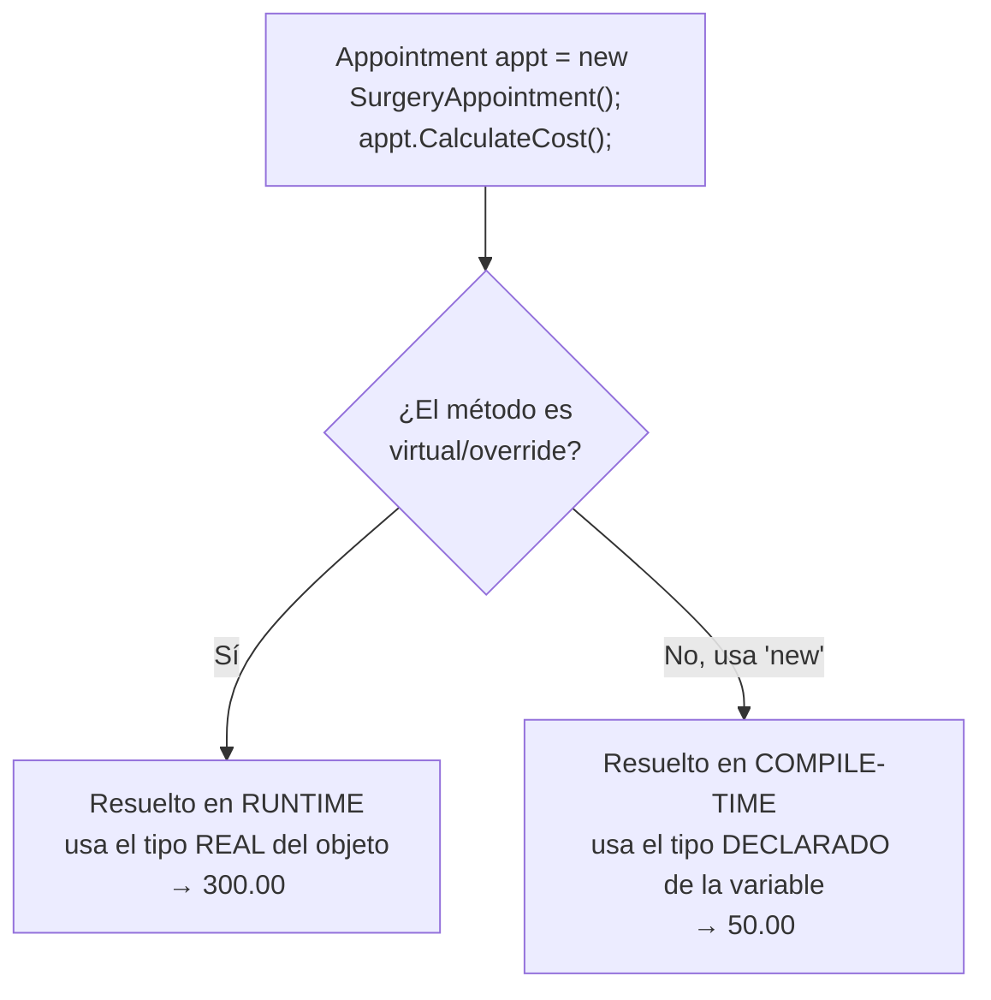

# 🧩 Tema 4: Virtual / Override / Overload

**Dominio de referencia:** Dental Clinic

---

## 🎯 Concepto

Tres palabras que suenan parecidas pero hacen cosas distintas:

- **`virtual`** — etiqueta en la clase base: "este método puede ser reemplazado por las hijas."
- **`override`** — usada en la clase hija: "voy a reemplazar ese método `virtual` con mi propia versión."
- **Overload (sobrecarga)** — mismo nombre de método, **parámetros diferentes**, en la misma clase. No tiene relación con herencia.

---

## 1️⃣ Virtual + Override

```csharp
public class Appointment
{
    public virtual decimal CalculateCost()   // "esto se puede reemplazar"
    {
        return 50.00m; // Costo base de consulta general
    }
}

public class SurgeryAppointment : Appointment
{
    public override decimal CalculateCost()  // "aquí está mi versión"
    {
        return 300.00m; // Las cirugías cuestan más
    }
}
```

```csharp
Appointment appt = new SurgeryAppointment();
Console.WriteLine(appt.CalculateCost()); // 300.00 — usa la versión de la hija
```

Aunque `appt` está declarada como `Appointment`, C# recuerda que el objeto real es `SurgeryAppointment` y usa su versión. Esto es **polimorfismo en tiempo de ejecución** — la decisión se toma mientras el programa corre.

---

## 2️⃣ Overload (Sobrecarga)

```csharp
public class AppointmentScheduler
{
    public void ScheduleAppointment(Guid patientId, DateTime date)
    {
        Console.WriteLine("Cita agendada sin especificar dentista");
    }

    public void ScheduleAppointment(Guid patientId, DateTime date, Guid dentistId)
    {
        Console.WriteLine("Cita agendada con dentista específico");
    }
}
```

```csharp
scheduler.ScheduleAppointment(patientId, date);              // primera versión
scheduler.ScheduleAppointment(patientId, date, dentistId);   // segunda versión
```

C# decide cuál llamar **en tiempo de compilación**, según la cantidad/tipo de parámetros. No requiere herencia.

---

## ⚠️ El error clásico: quitar `virtual`

```csharp
public class Appointment
{
    public decimal CalculateCost()  // sin "virtual"
    {
        return 50.00m;
    }
}

public class SurgeryAppointment : Appointment
{
    public override decimal CalculateCost()  // ❌ ERROR DE COMPILACIÓN
    {
        return 300.00m;
    }
}
```

**Error exacto del compilador:**
```
CS0506: 'SurgeryAppointment.CalculateCost()': cannot override inherited member
'Appointment.CalculateCost()' because it is not marked virtual, abstract, or override
```

`override` requiere un permiso explícito (`virtual`) del padre. Sin ese permiso, el compilador rechaza el código.

---

## 🔍 El detalle que atrapa en entrevistas: Method Hiding (`new`)

Si en vez de `override` usas `new`, el código **sí compila**, pero rompe el polimorfismo:

```csharp
public class Appointment
{
    public decimal CalculateCost() => 50.00m;  // sin virtual
}

public class SurgeryAppointment : Appointment
{
    public new decimal CalculateCost() => 300.00m;  // "new" en vez de "override"
}
```

```csharp
Appointment appt = new SurgeryAppointment();
Console.WriteLine(appt.CalculateCost()); // ⚠️ imprime 50.00, NO 300.00
```

Aquí **no hay polimorfismo real** — el compilador resuelve qué método llamar según el **tipo declarado de la variable** (`Appointment`), no el objeto real. El compilador solo emite un *warning*, no un error — fácil de pasar por alto y causa bugs sutiles.

---

## 📊 Diagrama: Resolución en tiempo de ejecución vs. compilación



---

## ⚖️ Comparación rápida

| | Virtual/Override | Overload |
|---|---|---|
| Requiere herencia | Sí | No |
| Misma firma de método | Sí | No (parámetros distintos) |
| Cuándo se resuelve | Tiempo de ejecución (runtime) | Tiempo de compilación |
| Propósito | Polimorfismo | Conveniencia de API (mismo nombre, distintos inputs) |

---

## 🎤 Respuesta Senior (English)

> "Without `virtual` on the base method, `override` in the derived class produces a compile-time error — CS0506 — because `override` requires an explicit contract from the base class saying the method can be replaced. If you use `new` instead, the code compiles, but you lose runtime polymorphism: the compiler resolves which method to call based on the declared type of the variable, not the actual object type, which silently produces the wrong behavior when working through a base class reference. This distinction — method overriding vs. method hiding — is a common source of subtle bugs in inheritance hierarchies. Overload, by contrast, has nothing to do with inheritance at all — it's resolved entirely at compile time based on the method signature."

---

## 📝 Puntos clave para recordar

- `virtual` = permiso del padre. `override` = uso de ese permiso por el hijo.
- Sin `virtual`, `override` es un error de compilación (CS0506).
- `new` en vez de `override` compila pero rompe polimorfismo (method hiding) — bug sutil y común.
- Overload no tiene relación con herencia; se resuelve en tiempo de compilación por firma de parámetros.
