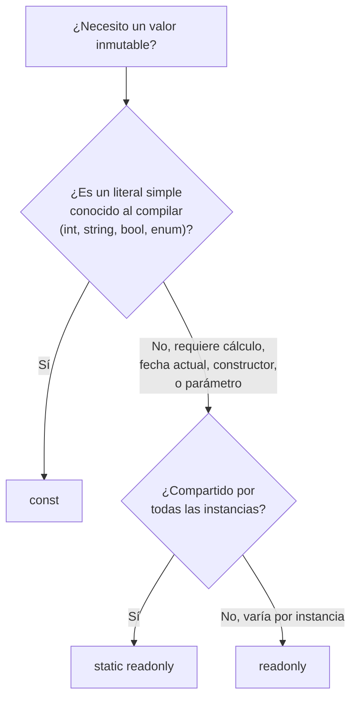

# 🧩 Tema 5: Readonly / Constant

**Dominio de referencia:** Dental Clinic

---

## 🎯 Concepto

Dos formas de decir "este valor no cambia", pero funcionan muy distinto:

- **`const`** — el valor se fija **al compilar el código**, antes de ejecutar nada. Debe ser un **literal** de un tipo primitivo (número, texto, bool, enum) o `null`, conocido de antemano.
- **`readonly`** — el valor se fija **una sola vez, pero en tiempo de ejecución** — típicamente en el constructor. Puede venir de un cálculo, de la fecha actual, de un parámetro.

---

## 💻 Ejemplo

```csharp
public class Appointment
{
    // CONST: mismo valor para TODAS las instancias, grabado en el código compilado
    public const int MaxDurationMinutes = 120;

    // READONLY: se asigna en el constructor, puede variar según la instancia
    public readonly DateTime CreatedAt;

    public Appointment()
    {
        CreatedAt = DateTime.UtcNow; // ✅ válido — asignado en el constructor
    }

    public void TryChange()
    {
        // CreatedAt = DateTime.UtcNow; // ❌ ERROR: no se puede reasignar fuera del constructor
    }
}
```

---

## ⚠️ El caso límite: por qué `const DateTime` no compila

```csharp
public class ClinicSettings
{
    public const decimal TaxRate = 0.16m;               // ✅ compila — literal simple

    public const DateTime OpeningDate = DateTime.UtcNow; // ❌ NO compila
}
```

**Error del compilador:**
```
CS0133: The expression being assigned to 'ClinicSettings.OpeningDate'
must be constant
```

**Por qué falla, con precisión técnica:**
- `const` exige un valor que el compilador pueda **embeber directamente en el IL compilado** — solo literales de tipos primitivos.
- `DateTime.UtcNow` es una llamada a método que lee el reloj del sistema — su valor no existe hasta ejecutar el programa.
- Incluso un `DateTime` fijo como `new DateTime(2026, 1, 1)` **tampoco es válido para `const`**, porque construir un `DateTime` (es un `struct`) requiere ejecutar su constructor — y `const` no permite ejecutar código, ni el más simple. `DateTime` simplemente no es un tipo elegible para `const`, sin importar si el valor es fijo.

**Solución correcta:**
```csharp
public class ClinicSettings
{
    public static readonly DateTime OpeningDate = new DateTime(2026, 1, 1);
    // "static" porque es compartido por todas las instancias
    // "readonly" porque la asignación requiere ejecutar código (constructor de DateTime)
}
```

---

## 🔗 Conexión con Value Objects (Módulo 1)

```csharp
public record ContactInfo
{
    public string Email { get; init; }
    public string PhoneNumber { get; init; }
}
```

`init` es un primo cercano de `readonly` — se asigna una sola vez durante la construcción del objeto y queda congelado. Misma filosofía de inmutabilidad aplicada a Value Objects.

---

## 📊 Diagrama de decisión



---

## ⚖️ Comparación rápida

| | `const` | `readonly` |
|---|---|---|
| Se fija en | Tiempo de compilación | Tiempo de ejecución (constructor) |
| Tipos permitidos | Solo literales primitivos | Cualquier tipo |
| ¿Puede variar por instancia? | No, siempre igual para todos | Sí, puede variar por instancia |
| ¿Requiere `static`? | Implícito (siempre compartido) | Opcional, según el caso |

---

## 🎤 Respuesta Senior (English)

> "`const` requires a value the compiler can embed directly into the compiled IL at compile time — that means only literal values of primitive types, evaluated with zero runtime execution. `DateTime.UtcNow` is a method call that reads the system clock, so its value doesn't exist until the program runs. Even a fixed `DateTime` isn't valid for `const`, because constructing a `DateTime` struct still requires executing code at runtime; `DateTime` simply isn't a `const`-eligible type in C#, regardless of whether the value is fixed. For values like this, I use `static readonly` instead — it's still assigned only once, but the assignment happens at runtime during type initialization, which is exactly what a computed or constructed value needs."

---

## 📝 Puntos clave para recordar

- `const` = literal puro, fijado al compilar, mismo valor para todo el programa.
- `readonly` = fijado una vez, pero en runtime (constructor), puede variar por instancia.
- `DateTime` nunca es `const`-eligible, sin importar si el valor es fijo — usa `static readonly`.
- `init` (en records/Value Objects) sigue la misma filosofía de inmutabilidad que `readonly`.
