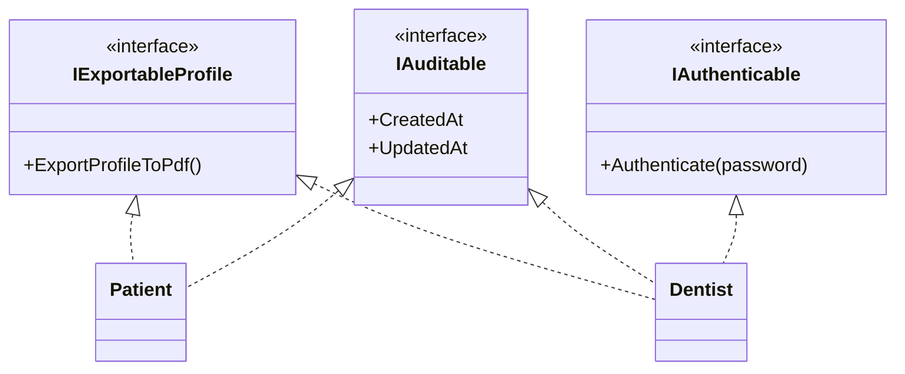

# 🧩 Tema 6: Multiple Interface Implementation

**Dominio de referencia:** Dental Clinic

---

## 🎯 Concepto

En C# una clase **no puede** heredar de más de una clase base (herencia simple — Tema 2). Pero sí puede **implementar tantas interfaces como quiera**, sin límite.

```csharp
public class Patient : IExportableProfile, IAuditable, ISearchable
{
    // debe implementar los miembros de las TRES interfaces
}
```

**Por qué es posible:** una interfaz no trae estado ni código real, solo un contrato. C# puede combinar varios contratos libremente porque no hay campos ni lógica compartida que genere ambigüedad — a diferencia de las clases, donde dos bases podrían tener miembros en conflicto.

---

## 💻 Ejemplo con Dental Clinic

```csharp
public interface IExportableProfile
{
    byte[] ExportProfileToPdf();
}

public interface IAuditable
{
    DateTime CreatedAt { get; }
    DateTime? UpdatedAt { get; }
}

public interface ISearchable
{
    string GetSearchIndexText();
}

public class Patient : IExportableProfile, IAuditable, ISearchable
{
    public DateTime CreatedAt { get; private set; }
    public DateTime? UpdatedAt { get; private set; }

    public byte[] ExportProfileToPdf() => Array.Empty<byte>();

    public string GetSearchIndexText() => $"{Name.FullName} {Contact.Email}";
}
```

Cada interfaz es consumida por una parte distinta del sistema (reportes, auditoría, búsqueda) — completamente desacopladas entre sí.

---

## ⚠️ Colisión de nombres: Implementación Explícita

```csharp
public interface IPrintable
{
    void Print();
}

public interface ILoggable
{
    void Print(); // mismo nombre, propósito distinto
}

public class Appointment : IPrintable, ILoggable
{
    void IPrintable.Print()
    {
        Console.WriteLine("Imprimiendo comprobante de cita...");
    }

    void ILoggable.Print()
    {
        Console.WriteLine("Registrando log de cita...");
    }
}
```

```csharp
Appointment appt = new Appointment();
// appt.Print(); // ❌ ambiguo

((IPrintable)appt).Print();  // ✅
((ILoggable)appt).Print();   // ✅
```

---

## 🚨 El problema real: interfaces "gordas" (Fat Interfaces)

**Diseño incorrecto — una interfaz gigante:**

```csharp
public interface IDentistCapabilities
{
    byte[] ExportProfileToPdf();
    DateTime CreatedAt { get; }
    bool Authenticate(string password);
}
```

Si `Patient` también necesita exportarse y ser auditado, pero **nunca** se autentica:

```csharp
public class Patient : IDentistCapabilities  // ⚠️ nombre sin sentido para Patient
{
    public byte[] ExportProfileToPdf() { ... }
    public DateTime CreatedAt { get; private set; }

    public bool Authenticate(string password)
    {
        throw new NotSupportedException("Patients don't log in."); // 🚨 señal de mal diseño
    }
}
```

`Patient` queda forzado a implementar algo que no tiene sentido para su dominio — el problema se detecta en **runtime**, no en compilación.

**Diseño correcto — interfaces pequeñas y enfocadas:**

```csharp
public class Patient : IExportableProfile, IAuditable  // solo lo que necesita
{
    public byte[] ExportProfileToPdf() { ... }
    public DateTime CreatedAt { get; private set; }
}

public class Dentist : IExportableProfile, IAuditable, IAuthenticable  // los tres
{
    public byte[] ExportProfileToPdf() { ... }
    public DateTime CreatedAt { get; private set; }
    public bool Authenticate(string password) { ... }
}
```

Ninguna clase implementa algo que no usa realmente. Esto es el **Interface Segregation Principle** (Tema 10) aplicado en la práctica.

---

## 📊 Diagrama



---

## ⚖️ Trade-offs

| Ventajas | Desventajas |
|---|---|
| Sin límite de interfaces implementadas | Riesgo de colisión de nombres (mitigado con implementación explícita) |
| Evita forzar métodos sin sentido en una clase | Demasiadas interfaces diminutas pueden fragmentar el diseño si se abusa |
| Cada clase declara exactamente lo que puede hacer | — |

---

## 🎤 Respuesta Senior (English)

> "I'd use several small interfaces rather than one large `IDentistCapabilities` interface, because the two designs behave very differently once a second class enters the picture. If `Patient` later needs `ExportProfileToPdf` and `IAuditable`, but never authentication, the fat-interface design forces `Patient` to implement `Authenticate` anyway — either throwing `NotSupportedException` at runtime or faking a meaningless implementation. That's a runtime problem masquerading as a compile-time contract. With small, focused interfaces, `Patient` simply implements `IExportableProfile` and `IAuditable` and never touches `IAuthenticable` — the compiler enforces exactly what each class can do, with zero dead or dishonest methods. This is the Interface Segregation Principle in practice: no class should be forced to depend on behavior it doesn't use."

---

## 📝 Puntos clave para recordar

- Herencia simple para clases, implementación múltiple libre para interfaces.
- Colisión de nombres entre interfaces se resuelve con implementación explícita.
- Interfaces "gordas" fuerzan implementaciones sin sentido — señal de alarma: `NotSupportedException` en un método de interfaz.
- Este tema es la base práctica del Interface Segregation Principle (Tema 10).
