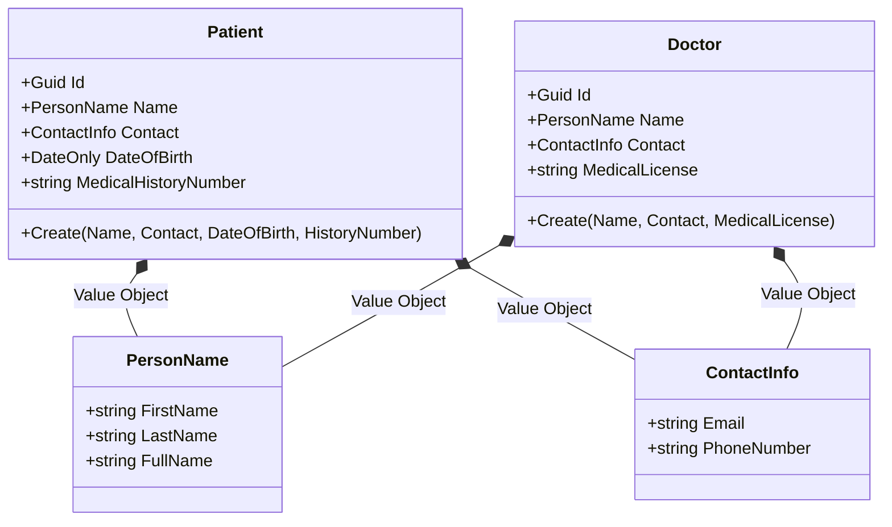

# 🏛️ Composition vs Inheritance: Value Objects & EF Core 8

🎯 **Objective:** Comprender a fondo cómo se aplica la Composición en Domain-Driven Design (DDD) y cómo se mapea de forma óptima a la base de datos con Entity Framework Core 8.

**Dominio de referencia:** Dental Clinic / Sistema Dental

---

## 🧠 ¿Por qué NO usar Clase Abstracta `Person` ni Interfaz `IPerson`?

### ❌ 1. Clase Abstracta `Person` (Herencia de Datos)

- **Invariantes de Dominio:** `Patient` y `Doctor` no son variantes de persona; son **ROLES y AGREGADOS independientes**. Mezclar sus atributos destruye la encapsulación del dominio.
- **Impacto en BD (EF Core):**
  - **TPH (Table Per Hierarchy):** Genera una sola tabla `People` llena de columnas `NULL` (ej. la Cédula Médica queda `NULL` en pacientes, el Historial Médico queda `NULL` en doctores).
  - **TPT (Table Per Type):** Genera múltiples tablas enlazadas por `JOINs` obligatorios en cada lectura, degradando severamente la velocidad de consulta.

### ❌ 2. Interfaz `IPerson`

- Las interfaces definen **capacidades/contratos** (*can-do*), no estado persistible (*fields/properties*).
- Crear `IPerson` cuando no existe un caso de uso polimórfico real en la capa de aplicación es sobre-ingeniería (principio **YAGNI**).

---

## 🏛️ La Solución: Composición con Value Objects

Aplicamos el principio **"Tiene-un" (*Has-a*)**:

- `Patient` **TIENE UN** `PersonName` y **TIENE UN** `ContactInfo`.
- `Doctor` **TIENE UN** `PersonName` y **TIENE UN** `ContactInfo`.



### 💻 1. Value Objects Inmutables (C# .NET 8)

```csharp
namespace Healthcare.Domain.ValueObjects;

public record PersonName
{
    public string FirstName { get; init; }
    public string LastName { get; init; }

    public PersonName(string firstName, string lastName)
    {
        if (string.IsNullOrWhiteSpace(firstName))
            throw new DomainException("First name is required.");

        if (string.IsNullOrWhiteSpace(lastName))
            throw new DomainException("Last name is required.");

        FirstName = firstName;
        LastName = lastName;
    }

    public string FullName => $"{FirstName} {LastName}";
}

public record ContactInfo
{
    public string Email { get; init; }
    public string PhoneNumber { get; init; }

    public ContactInfo(string email, string phoneNumber)
    {
        if (!email.Contains("@"))
            throw new DomainException("Invalid email format.");

        Email = email;
        PhoneNumber = phoneNumber;
    }
}
```

> **Nota:** El `record` de C# aporta inmutabilidad e igualdad por valor nativamente. La validación vive en el constructor, escrita UNA sola vez en el Value Object.

### 💻 2. Agregados Compuestos (Patient y Doctor)

```csharp
namespace Healthcare.Domain.Aggregates.PatientAggregate;

using Healthcare.Domain.ValueObjects;

public class Patient
{
    public Guid Id { get; private set; }

    // COMPOSICIÓN: Se "insertan" los Value Objects
    public PersonName Name { get; private set; }
    public ContactInfo Contact { get; private set; }

    // Atributos EXCLUSIVOS del Paciente
    public DateOnly DateOfBirth { get; private set; }
    public string MedicalHistoryNumber { get; private set; }

    private Patient() { } // EF Core

    public static Patient Create(PersonName name, ContactInfo contact, DateOnly dateOfBirth, string medicalHistoryNumber)
    {
        return new Patient
        {
            Id = Guid.NewGuid(),
            Name = name,
            Contact = contact,
            DateOfBirth = dateOfBirth,
            MedicalHistoryNumber = medicalHistoryNumber
        };
    }
}
```

### 🗄️ 3. Mapeo en EF Core 8 (Complex Types)

```csharp
public class PatientConfiguration : IEntityTypeConfiguration<Patient>
{
    public void Configure(EntityTypeBuilder<Patient> builder)
    {
        builder.HasKey(p => p.Id);

        // MAPEO POR COMPOSICIÓN (.NET 8 Complex Types)
        builder.ComplexProperty(p => p.Name, nameBuilder =>
        {
            nameBuilder.Property(n => n.FirstName).HasColumnName("FirstName").HasMaxLength(100).IsRequired();
            nameBuilder.Property(n => n.LastName).HasColumnName("LastName").HasMaxLength(100).IsRequired();
        });

        builder.ComplexProperty(p => p.Contact, contactBuilder =>
        {
            contactBuilder.Property(c => c.Email).HasColumnName("Email").HasMaxLength(150).IsRequired();
            contactBuilder.Property(c => c.PhoneNumber).HasColumnName("PhoneNumber").HasMaxLength(20);
        });
    }
}
```

### 📊 4. Resultado en SQL Server (Tablas Planas Sin JOINs)

**Tabla `dbo.Patients`:**

| Columna | Tipo | Origen |
|---|---|---|
| Id | uniqueidentifier (PK) | Agregado |
| FirstName | varchar(100) | PersonName |
| LastName | varchar(100) | PersonName |
| Email | varchar(150) | ContactInfo |
| PhoneNumber | varchar(20) | ContactInfo |
| DateOfBirth | date | Agregado |
| MedicalHistoryNumber | varchar(50) | Agregado |

DDL completo:

```sql
CREATE TABLE [dbo].[Patients] (
    [Id] UNIQUEIDENTIFIER NOT NULL PRIMARY KEY,
    [FirstName] NVARCHAR(100) NOT NULL,
    [LastName] NVARCHAR(100) NOT NULL,
    [Email] NVARCHAR(150) NOT NULL,
    [PhoneNumber] NVARCHAR(20) NULL,
    [DateOfBirth] DATE NOT NULL,
    [MedicalHistoryNumber] NVARCHAR(50) NOT NULL
);
```

---

## ⚖️ Ventajas de este Diseño

1. **Cero JOINs:** Consultas SQL súper rápidas.
2. **Sin campos NULL:** No hay contaminación de datos entre doctores y pacientes.
3. **Reglas de negocio centralizadas:** Las validaciones de correo o nombre están escritas una sola vez en el Value Object.
4. **Resistencia al Cambio:** Cambiar el modelo de Doctor no rompe la estructura del Paciente.

---

## 🎤 Respuesta Senior (English)

> **Q:** *"Why did you model Patient and Doctor using composition instead of a shared Person base class?"*
>
> **A:** "Patient and Doctor aren't variants of the same concept — they're independent domain aggregates with different invariants. Modeling them with a shared abstract `Person` class or an `IPerson` interface creates real problems in EF Core: Table-Per-Hierarchy produces a single table riddled with NULL columns, while Table-Per-Type forces expensive JOINs on every read. Instead, I apply a Has-A relationship: both `Patient` and `Doctor` contain a `PersonName` and `ContactInfo` value object. This gives zero JOINs, zero NULL contamination, and centralizes validation logic in the value objects themselves, all while keeping each aggregate's schema flat and fast to query."

---

## 📝 Puntos clave para recordar

- Paciente y Doctor son **agregados independientes**, no subclases de una `Person`.
- TPH → columnas NULL; TPT → JOINs forzados. Ambos degradan rendimiento.
- Composición (`Has-a`) con Value Objects resuelve ambos problemas.
- `.ComplexProperty()` de EF Core 8 mapea Value Objects a columnas planas sin tablas hijas.
- Una interfaz `IPerson` sin caso de uso polimórfico real es sobre-ingeniería (YAGNI).