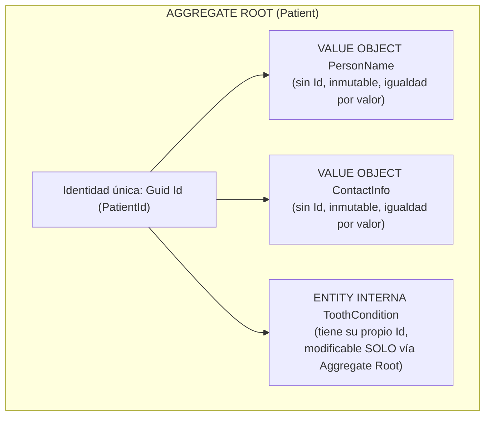

# 🧠 DDD: Entities, Value Objects y Aggregate Roots

**Dominio de referencia:** Dental Clinic (Patient, ToothCondition, ToothPosition)

---

## 🎯 Concepto

En aplicaciones complejas (como un sistema clínico dental), mezclar estos tres conceptos o tratar todo como "clases anémicas de base de datos" es el error #1 que arruina la mantenibilidad del software.



---

## 1. Value Objects (Objetos de Valor)

### ❓ ¿Qué es?

Es un objeto que se define únicamente por el **valor de sus atributos**, no por una identidad (Id). Si dos Value Objects tienen los mismos valores, son idénticos. Además, deben ser **inmutables**.

### 🦷 Ejemplo en la Clínica Dental

- `ToothPosition`: Número de diente (1 al 32) y cuadrante.
- `PersonName`: Primer nombre y apellido.
- `Money`: Monto decimal + Moneda ("USD", "MXN").
- `ToothSurface`: Superficie del diente (Oclusal, Mesial, Distal, Vestibular, Lingual).

Si dos odontogramas indican que se realizó una resina en el Diente 18, Superficie Oclusal, la definición de la superficie y la posición es idéntica independientemente de a qué paciente pertenezca.

### 💻 Implementación en C# .NET 8

Usamos `record` de C# porque nos da inmutabilidad e igualdad por valor nativamente de forma limpia.

```csharp
namespace DentalClinic.Domain.ValueObjects;

public record ToothPosition
{
    public int ToothNumber { get; init; } // 1 a 32 (FDI / Universal System)
    public Quadrant Quadrant { get; init; }

    public ToothPosition(int toothNumber, Quadrant quadrant)
    {
        if (toothNumber < 1 || toothNumber > 32)
            throw new DomainException("Invalid tooth number for adult dentition.");

        ToothNumber = toothNumber;
        Quadrant = quadrant;
    }
}

public enum Quadrant { UpperRight = 1, UpperLeft = 2, LowerLeft = 3, LowerRight = 4 }
```

---

## 2. Entities (Entidades)

### ❓ ¿Qué es?

Una Entidad se define por su **Identidad única (Id)**, la cual se mantiene constante a lo largo de todo su ciclo de vida, aunque sus atributos cambien con el tiempo.

### 🦷 Ejemplo en la Clínica Dental

- **`ToothCondition`:** La condición o diagnóstico de un diente específico en un paciente (ej. Diente 14 tiene una caries profunda). Si el dentista le aplica una amalgama, los atributos cambian (de Caries a Obturado), pero sigue siendo el mismo registro de diente en la historia clínica.
- **`Appointment`:** Una cita médica dental. Cambia de estado (Scheduled → InProgress → Completed), pero su `AppointmentId` es el mismo.

### 💻 Implementación en C# .NET 8

```csharp
namespace DentalClinic.Domain.Entities;

using DentalClinic.Domain.ValueObjects;

public class ToothCondition
{
    public Guid Id { get; private set; }
    public ToothPosition Position { get; private set; } // Value Object
    public ToothStatus Status { get; private set; }     // Ej: Healthy, Caries, Filled, Extracted
    public string? Notes { get; private set; }

    private ToothCondition() { } // EF Core

    internal ToothCondition(ToothPosition position, ToothStatus initialStatus)
    {
        Id = Guid.NewGuid();
        Position = position;
        Status = initialStatus;
    }

    internal void ApplyTreatment(ToothStatus newStatus, string notes)
    {
        Status = newStatus;
        Notes = notes;
    }
}

public enum ToothStatus { Healthy, Caries, Filled, Missing, CrownNeeded }
```

---

## 3. Aggregate Root (Raíz de Agregado)

### ❓ ¿Qué es?

Es la **Entidad Principal** que actúa como puerta de entrada para un grupo de Entidades y Value Objects relacionados (el Agregado).

### 📏 La Regla de Oro de DDD

> Ningún código externo (Controlador, Handler o Servicio) puede modificar directamente las Entidades internas de un Agregado. Cualquier cambio debe realizarse **a través de la Raíz de Agregado (Aggregate Root)**. Esto garantiza que las reglas de negocio (invariantes) se cumplan siempre.

### 🦷 Ejemplo en la Clínica Dental (Patient Aggregate)

El `Patient` es la raíz del agregado. Dentro del paciente se encuentra su **Odontograma** (`List<ToothCondition>`).

- **Acción Incorrecta (Anti-Patrón):** Buscar directamente la entidad `ToothCondition` en la BD y cambiarle el status a `Filled`. Esto salta las reglas del paciente (ej. verificar si el paciente está activo o si el presupuesto fue aprobado).
- **Acción Correcta (DDD):** Cargar al `Patient` (Aggregate Root) y llamar al método `patient.ApplyToothTreatment(toothNumber, ToothStatus.Filled)`.

### 💻 Código de la Raíz de Agregado

```csharp
namespace DentalClinic.Domain.Aggregates.PatientAggregate;

using DentalClinic.Domain.Entities;
using DentalClinic.Domain.ValueObjects;

public class Patient
{
    public Guid Id { get; private set; }
    public PersonName Name { get; private set; }     // Value Object
    public ContactInfo Contact { get; private set; } // Value Object

    private readonly List<ToothCondition> _odontogram = new();
    public IReadOnlyCollection<ToothCondition> Odontogram => _odontogram.AsReadOnly();

    private Patient() { }

    public static Patient Create(PersonName name, ContactInfo contact)
    {
        var patient = new Patient
        {
            Id = Guid.NewGuid(),
            Name = name,
            Contact = contact
        };
        patient.InitializeDefaultOdontogram();
        return patient;
    }

    // Regla de Negocio en la Raíz de Agregado
    public void ApplyToothTreatment(int toothNumber, Quadrant quadrant, ToothStatus newStatus, string notes)
    {
        var tooth = _odontogram.FirstOrDefault(t => t.Position.ToothNumber == toothNumber);

        if (tooth == null)
            throw new DomainException($"Tooth #{toothNumber} is not present in the patient's odontogram.");

        if (tooth.Status == ToothStatus.Missing)
            throw new DomainException($"Cannot perform treatment on missing tooth #{toothNumber}.");

        tooth.ApplyTreatment(newStatus, notes);
    }

    private void InitializeDefaultOdontogram()
    {
        for (int i = 1; i <= 32; i++)
        {
            var quadrant = (Quadrant)((i - 1) / 8 + 1);
            _odontogram.Add(new ToothCondition(new ToothPosition(i, quadrant), ToothStatus.Healthy));
        }
    }
}
```

---

## ⚖️ Cuadro Comparativo de Conceptos

| Criterio | Value Object | Entity | Aggregate Root |
|---|---|---|---|
| Identidad (Id) | No tiene Id | Tiene Id único | Tiene Id único global |
| Igualdad | Por el valor de sus campos | Por su Id | Por su Id |
| Mutabilidad | Inmutable (C# `record`) | Mutable (vía comportamientos) | Mutable (vía comportamientos) |
| Acceso desde afuera | Se pasa por copia/valor | Solo accesible desde su Aggregate Root | Punto de acceso directo vía Repositorios |
| Ejemplo Dental | `ToothPosition(18, UpperRight)` | `ToothCondition` (Diente con Caries) | `Patient` |

---

## 🎤 Respuesta Senior (English)

> **Q:** *"What is the difference between an Entity, a Value Object, and an Aggregate Root in DDD?"*
>
> **A:** "In Domain-Driven Design: 1) A **Value Object** has no identity and is defined strictly by its attributes. It is immutable and compared by value equality — like a `ToothPosition` or `Money` in C# using `record`. 2) An **Entity** is defined by a unique, thread-safe Identity (Id) that remains constant throughout its lifecycle, regardless of state changes — like a specific `ToothCondition` or `Appointment`. 3) An **Aggregate Root** is the primary Entity that controls access to a boundary of related Entities and Value Objects. It enforces consistency and business invariants. External services must never modify child entities directly; all changes must pass through the Aggregate Root — such as invoking `patient.ApplyToothTreatment()` on the `Patient` aggregate."

---

## 📝 Puntos clave para recordar

- Value Object = sin Id, inmutable, igualdad por valor (`record`).
- Entity = Id único constante; atributos mutables vía comportamientos.
- Aggregate Root = puerta de entrada única; protege invariantes.
- Anti-patrón: modificar entidades internas de un Agregado directamente desde el exterior.
- Relacionado: composición con Value Objects y mapeo EF Core en `02-DDD/01-Composition-vs-Inheritance-ValueObjects.md`.