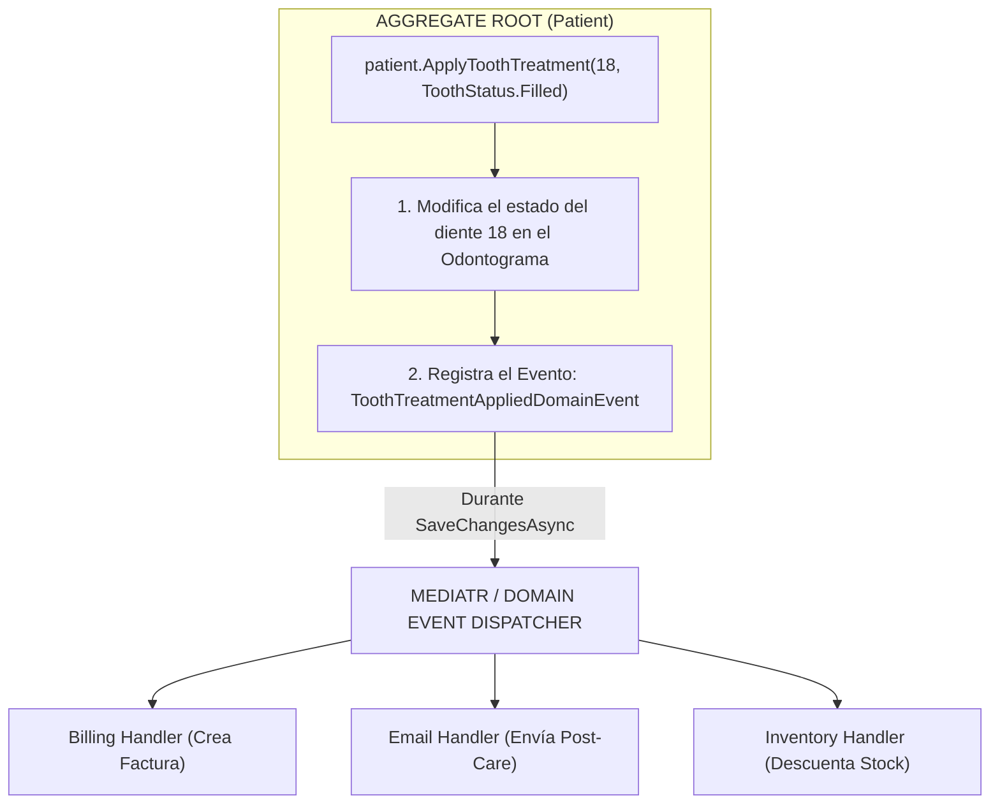

# ⚡ DDD: Domain Events (Eventos de Dominio)

**Dominio de referencia:** Dental Clinic (Patient, Billing, Notifications, Inventory)

---

## 1. ¿Qué es un Domain Event y qué problema resuelve?

Un Domain Event representa **algo que ya ocurrió en el pasado** dentro del dominio de la aplicación y que tiene un significado importante para el negocio.

### 💡 La Regla Gramatical de DDD

Los eventos de dominio se nombran siempre en **tiempo pasado**:

- ❌ `CompleteAppointment` → Esto es un **Command** (una intención de hacer algo).
- ✅ `AppointmentCompletedDomainEvent` → Esto es un **Domain Event** (algo que ya sucedió).
- ✅ `ToothTreatmentAppliedDomainEvent`
- ✅ `PatientRegisteredDomainEvent`

### ❌ El Problema del Acoplamiento (Sin Domain Events)

Imagina que cuando un dentista aplica un tratamiento a un diente (`patient.ApplyToothTreatment(...)`), el negocio exige 4 acciones automáticas:

1. Crear el cargo financiero en el sistema de facturación.
2. Enviar un correo al paciente con las indicaciones post-procedimiento.
3. Actualizar la agenda del consultorio.
4. Notificar al sistema de inventario para descontar el material (resina, anestesia, etc.).

Si el método `ApplyToothTreatment` dentro del Agregado `Patient` tuviera que llamar directamente a `IBillingService`, `IEmailSender` e `IInventoryManager`:

- Romperías la pureza del modelo de dominio (inyectando dependencias de infraestructura dentro del modelo).
- Harías que el Agregado `Patient` sea gigantesco e imposible de mantener.
- Probar con Unit Tests ese método requeriría mockear 10 servicios externos.

---

## 2. La Solución: El Ciclo de Vida del Domain Event

Con Domain Events, el Agregado solo se encarga de **cambiar su estado interno y registrar un evento**. La aplicación (mediante un mediador como **MediatR**) se encarga de publicar ese evento a múltiples Handlers totalmente independientes.



---

## 3. Implementación Práctica en C# .NET 8

### A) La Interfaz Base y el Evento en la Capa de Dominio

```csharp
namespace DentalClinic.Domain.Common;

public interface IDomainEvent : INotification // INotification es la interfaz de MediatR
{
    DateTime OccurredOn { get; }
}
```

```csharp
namespace DentalClinic.Domain.Aggregates.PatientAggregate.Events;

// Evento de Dominio: Inmutable (record) y en tiempo pasado
public record ToothTreatmentAppliedDomainEvent(
    Guid PatientId,
    int ToothNumber,
    string TreatmentDetails,
    decimal Cost,
    DateTime OccurredOn) : IDomainEvent;
```

### B) Captura de Eventos dentro del Aggregate Root (Patient)

```csharp
namespace DentalClinic.Domain.Aggregates.PatientAggregate;

public class Patient
{
    public Guid Id { get; private set; }
    private readonly List<ToothCondition> _odontogram = new();

    private readonly List<IDomainEvent> _domainEvents = new();
    public IReadOnlyCollection<IDomainEvent> DomainEvents => _domainEvents.AsReadOnly();

    public void ClearDomainEvents() => _domainEvents.Clear();

    protected void RaiseDomainEvent(IDomainEvent domainEvent)
    {
        _domainEvents.Add(domainEvent);
    }

    public void ApplyToothTreatment(int toothNumber, ToothStatus newStatus, decimal cost, string notes)
    {
        var tooth = _odontogram.FirstOrDefault(t => t.Position.ToothNumber == toothNumber);
        if (tooth == null) throw new DomainException($"Tooth #{toothNumber} not found.");

        // 1. Modificar el estado interno
        tooth.ApplyTreatment(newStatus, notes);

        // 2. Registrar el Evento de Dominio (no se ejecuta aún, solo se registra)
        RaiseDomainEvent(new ToothTreatmentAppliedDomainEvent(
            PatientId: this.Id,
            ToothNumber: toothNumber,
            TreatmentDetails: notes,
            Cost: cost,
            OccurredOn: DateTime.UtcNow
        ));
    }
}
```

### C) El Interceptor de EF Core (Despachador de Eventos)

Una de las mejores prácticas en .NET para procesar Domain Events es publicarlos **justo en el momento en que se persisten los cambios** en la base de datos usando un `SaveChangesInterceptor` de Entity Framework Core:

```csharp
namespace DentalClinic.Infrastructure.Persistence.Interceptors;

using MediatR;
using Microsoft.EntityFrameworkCore.Diagnostics;

public class DispatchDomainEventsInterceptor : SaveChangesInterceptor
{
    private readonly IMediator _mediator;

    public DispatchDomainEventsInterceptor(IMediator mediator)
    {
        _mediator = mediator;
    }

    public override async ValueTask<InterceptionResult<int>> SavingChangesAsync(
        DbContextEventData eventData,
        InterceptionResult<int> result,
        CancellationToken ct = default)
    {
        await DispatchDomainEvents(eventData.Context);
        return await base.SavingChangesAsync(eventData, result, ct);
    }

    private async Task DispatchDomainEvents(DbContext? context)
    {
        if (context == null) return;

        // 1. Extraer todas las entidades que tienen eventos acumulados
        var domainEntities = context.ChangeTracker
            .Entries<Patient>() // O una clase base AggregateRoot
            .Where(x => x.Entity.DomainEvents.Any())
            .ToList();

        var domainEvents = domainEntities
            .SelectMany(x => x.Entity.DomainEvents)
            .ToList();

        // 2. Limpiar los eventos para evitar ejecuciones dobles
        domainEntities.ForEach(x => x.Entity.ClearDomainEvents());

        // 3. Publicar cada evento a través de MediatR
        foreach (var domainEvent in domainEvents)
        {
            await _mediator.Publish(domainEvent);
        }
    }
}
```

### D) Los Event Handlers (Efectos Secundarios Desacoplados)

```csharp
namespace DentalClinic.Application.Billing.EventHandlers;

// Handler #1: Encargado exclusivamente de la Facturación
public class CreateInvoiceOnToothTreatmentHandler : INotificationHandler<ToothTreatmentAppliedDomainEvent>
{
    private readonly IBillingRepository _billingRepository;

    public CreateInvoiceOnToothTreatmentHandler(IBillingRepository billingRepository)
    {
        _billingRepository = billingRepository;
    }

    public async Task Handle(ToothTreatmentAppliedDomainEvent notification, CancellationToken ct)
    {
        var invoice = Invoice.CreateForTreatment(
            patientId: notification.PatientId,
            description: $"Treatment on tooth #{notification.ToothNumber}: {notification.TreatmentDetails}",
            amount: notification.Cost
        );

        await _billingRepository.AddAsync(invoice, ct);
    }
}
```

```csharp
namespace DentalClinic.Application.Notifications.EventHandlers;

// Handler #2: Encargado de enviar las instrucciones de cuidado post-tratamiento
public class SendPostCareInstructionsHandler : INotificationHandler<ToothTreatmentAppliedDomainEvent>
{
    private readonly IEmailService _emailService;

    public SendPostCareInstructionsHandler(IEmailService emailService)
    {
        _emailService = emailService;
    }

    public async Task Handle(ToothTreatmentAppliedDomainEvent notification, CancellationToken ct)
    {
        await _emailService.SendAsync(
            patientId: notification.PatientId,
            subject: "Instrucciones de cuidado posterior al tratamiento",
            body: $"Estimado paciente, recuerde seguir los cuidados tras su tratamiento en el diente {notification.ToothNumber}"
        );
    }
}
```

---

## 🔑 Puntos Clave para Recordar

1. **Desacoplamiento:** El Agregado `Patient` no sabe cuántos Handlers existen ni qué hacen. Su única responsabilidad es notificar "Ocurrió un tratamiento en el diente 18".
2. **Transaccionalidad (In-Process vs Out-of-Process):**
   - **In-Process:** Si usas MediatR dentro del mismo hilo/proceso, si un handler falla, puedes optar por hacer rollback de toda la transacción.
   - **Out-of-Process (Integration Events):** Si el evento debe ser notificado a otro microservicio (ej. Azure Service Bus o RabbitMQ), el Domain Event se convierte en un **Integration Event** (ver Transactional Outbox en `06-Microservices/`).

---

## 🎤 Respuesta Senior (English)

> **Q:** *"What are Domain Events in DDD, and how do you dispatch them in .NET?"*
>
> **A:** "Domain Events represent side-effects or state changes that have occurred in the domain, named in the past tense — like `ToothTreatmentAppliedDomainEvent`. They solve the problem of coupling. Instead of having an Aggregate Root invoke external services like Emailing, Billing, or Inventory directly, the Aggregate simply captures the domain event in an internal collection. In .NET, I use an EF Core `SaveChangesInterceptor` combined with MediatR. Right before `SaveChangesAsync()` commits to the database, the interceptor reads the domain events from tracked entities, clears them, and publishes them via `IMediator.Publish()`. Handlers like `INotificationHandler<T>` then process the event independently, keeping the architecture clean, testable, and adhering to the Single Responsibility Principle."

---

## 📝 Puntos clave para recordar

- Los Domain Events se nombran en **tiempo pasado** (algo que ya ocurrió).
- El Agregado solo registra el evento; la aplicación lo despacha.
- Despacho con `SaveChangesInterceptor` + MediatR justo antes del commit.
- In-Process (MediatR) vs Out-of-Process (Integration Events / broker).