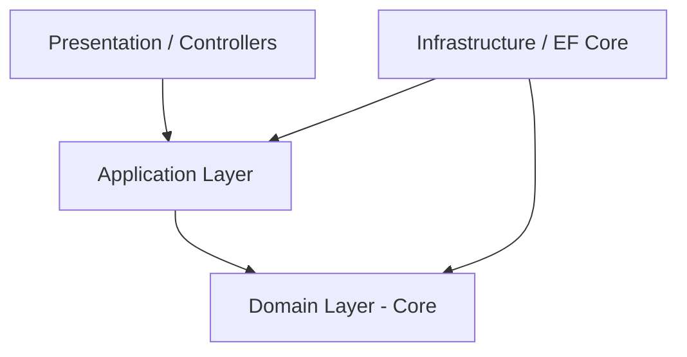

# 01-Architecture / Clean Architecture

---

## 1. Regla de Dependencia

Las dependencias apuntan **únicamente hacia adentro**. El Dominio no conoce nada de la Base de Datos, de la Web, ni de las APIs Externas.

---

## 2. Estructura de Capas



---

## 3. Organización de archivos (Dental Clinic)

```text
DentalClinic/
├── DentalClinic.Domain/
│   ├── Aggregates/
│   │   └── PatientAggregate/
│   ├── ValueObjects/
│   ├── Entities/
│   ├── Interfaces/          <- Contratos del dominio (IRepository, etc.)
│   └── Events/
├── DentalClinic.Application/
│   ├── Appointments/
│   │   ├── Commands/
│   │   └── Queries/
│   ├── Common/
│   │   └── Interfaces/      <- INotificationSender, IApplicationDbContext
│   └── Behaviors/
├── DentalClinic.Infrastructure/
│   ├── Persistence/
│   ├── Notifications/       <- Implementaciones concretas de INotificationSender
│   └── Interceptors/
└── DentalClinic.WebApi/
    ├── Controllers/
    └── Program.cs
```

---

## 4. 🎤 Respuesta de Entrevista en Inglés (Senior/Staff Level)

> **Interviewer:** *"Why Clean Architecture over traditional N-Tier architecture?"*
>
> **Your Answer:**  
> "Traditional N-Tier architectures often tightly couple business rules to the database layer because the UI calls the Business Logic Layer, which directly references the Data Access Layer. In **Clean Architecture**, we invert that dependency. The Domain layer sits at the center with zero external dependencies. This ensures that UI frameworks, ORMs, or cloud providers are merely infrastructure details that can be evolved, tested, or swapped without impacting core business rules."

---

## 📝 Puntos clave para recordar

- Regla de dependencia: apuntan hacia adentro, nunca hacia afuera.
- Domain (núcleo) no conoce ORMs, frameworks de UI ni cloud providers.
- Infrastructure implementa las abstracciones definidas en Application/Domain.
- El proyecto Dental Clinic es el ejemplo concreto de esta estructura (Tema 14 del playbook OOP).