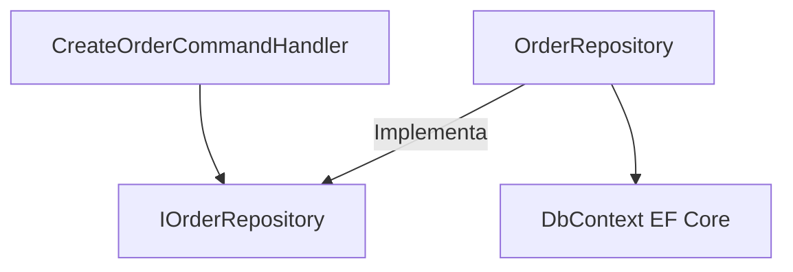

# 03-Patterns / Repository Pattern & Unit of Work

---

## 1. ¿Por qué nació el Repository Pattern y qué problema resuelve?

El Repository Pattern actúa como una **capa de abstracción** entre la lógica de negocio (Dominio/Aplicación) y la capa de acceso a datos (Infraestructura). Su objetivo principal es encapsular la lógica requerida para acceder a los datos de la fuente primaria (base de datos relacional, NoSQL, API externa) e **imitar una colección en memoria** de objetos de dominio.

**El problema que resuelve:**

- **Acoplamiento a ORMs:** Evita que los Casos de Uso (Application layer) dependan directamente de `DbContext` de EF Core o consultas SQL directas.
- **Testabilidad (Mocking):** Permite realizar pruebas unitarias sobre los casos de uso reemplazando el repositorio con una implementación simulada en memoria (Mock).
- **Duplicación de lógica de datos:** Centraliza consultas complejas (por ejemplo: filtrar clientes activos con sus órdenes del último mes).

---

## 2. Diagrama de Arquitectura (Dependency Inversion)



---

## 3. Implementación Práctica C# (.NET 8+)

### Interfaz de Repositorio Genérico e Interfaz Específica

```csharp
// Application/Contracts/Persistence/IGenericRepository.cs
public interface IGenericRepository<T> where T : class
{
    Task<T?> GetByIdAsync(Guid id);
    Task<IReadOnlyList<T>> GetAllAsync();
    Task<T> AddAsync(T entity);
    void Update(T entity);
    void Delete(T entity);
}
```

```csharp
// Application/Contracts/Persistence/ICustomerRepository.cs
public interface ICustomerRepository : IGenericRepository<Customer>
{
    Task<Customer?> GetCustomerWithOrdersAsync(Guid customerId);
    Task<bool> IsEmailUniqueAsync(string email);
}
```

### Implementación con Entity Framework Core

```csharp
// Infrastructure/Repositories/CustomerRepository.cs
public class CustomerRepository : GenericRepository<Customer>, ICustomerRepository
{
    private readonly ApplicationDbContext _dbContext;

    public CustomerRepository(ApplicationDbContext dbContext) : base(dbContext)
    {
        _dbContext = dbContext;
    }

    public async Task<Customer?> GetCustomerWithOrdersAsync(Guid customerId)
    {
        return await _dbContext.Customers
            .Include(c => c.Orders)
            .FirstOrDefaultAsync(c => c.Id == customerId);
    }

    public async Task<bool> IsEmailUniqueAsync(string email)
    {
        return !await _dbContext.Customers.AnyAsync(c => c.Email == email);
    }
}
```

---

## 4. ¿Por qué combinarlo con Unit of Work?

El patrón **Unit of Work (UoW)** mantiene una lista de objetos afectados por una transacción de negocio y coordina la escritura de cambios y la resolución de problemas de concurrencia. Mientras el Repository maneja las operaciones de lectura/escritura de un agregado específico, Unit of Work garantiza que **múltiples repositorios compartan el mismo contexto** de base de datos y confirmen sus operaciones en una sola transacción atómica (ACID).

```csharp
// Application/Contracts/Persistence/IUnitOfWork.cs
public interface IUnitOfWork : IDisposable
{
    ICustomerRepository Customers { get; }
    IOrderRepository Orders { get; }
    Task<int> CommitAsync(CancellationToken cancellationToken = default);
}
```

> Detalle completo del patrón UoW en `04-Architecture/05-UnitOfWork.md`.

---

## 5. El debate Senior: ¿EF Core ya es un Repository + Unit of Work?

**Sí.** En EF Core, `DbSet<T>` actúa como un Repository y `DbContext` actúa como un Unit of Work.

| Enfoque | Ventajas | Desventajas |
|---|---|---|
| **Directo con `DbContext`** | Menos código repetitivo, aprovecha todas las capacidades de LINQ/EF Core | Acopla la capa de aplicación a EF Core; dificulta mockear sin InMemory Database |
| **Abstracción Repository/UoW** | Aislamiento total, facilidad de pruebas unitarias puras, facilidad de cambiar el motor de persistencia | Capa extra de indirección (Over-engineering si la app es CRUD simple) |

### El Anti-Patrón Generic Repository

Crear un `GenericRepository<T>` sobre EF Core fuerza una abstracción incompleta (**Leaky Abstraction**) que inhabilita las mejores capacidades del ORM:

- Destruye la ejecución SQL diferida (`IQueryable`) al forzar evaluaciones prematuras en RAM.
- Impide proyecciones directas a DTOs con `.Select()`, generando querys pesados tipo `SELECT *`.
- Deshabilita optimizaciones críticas de memoria como `AsNoTracking()`.

**Decisión de Arquitectura:** En el lado de **Lectura (Queries)** no se usan repositorios; se consulta directamente `IQueryable` proyectando a DTOs. En el lado de **Escritura (Commands)**, se usan **Repositorios Explícitos de Dominio** únicamente para proteger los límites de los Aggregate Roots.

---

## 6. Respuestas de Entrevista (Senior & Staff Level)

> **Interviewer:** *"¿Cuándo implementarías Repository Pattern sobre Entity Framework Core y cuándo preferirías usar DbContext directamente?"*

**Respuesta Senior (Español):**

> "En arquitecturas orientadas al dominio o Clean Architecture, utilizo el Repository Pattern para abstraer la infraestructura de las reglas de negocio, permitiendo unit testing aislado y protegiendo el dominio de fugas de abstracción de EF Core. Sin embargo, para aplicaciones orientadas a CQRS o microservicios pequeños donde la capa de lectura utiliza DTOs directos, utilizar EF Core o Dapper directamente a través de DbContext evita capas innecesarias y maximiza el rendimiento."

**Senior Answer (English):**

> "Since EF Core already implements `DbSet` as a Repository, adding another layer can be redundant — it depends on the complexity of the domain. While `DbContext` and `DbSet` already implement Unit of Work and Repository patterns, introducing an explicit repository in Clean Architecture prevents EF Core primitives — like `IQueryable` — from leaking into application handlers or controllers. It establishes a clear boundary for pure domain entities and simplifies unit testing with mocks. However, for read-heavy or simple CQRS queries, bypassing custom repositories and querying EF Core or Dapper directly is often a pragmatic, high-performance trade-off."

---

## 7. Red Flags en Entrevistas 🚩

- ❌ Decir que usas Repository únicamente para "poder cambiar de base de datos SQL a Mongo mañana" (pocas empresas cambian de motor en la práctica).
- ❌ Llamar a `SaveChanges()` dentro de cada método de un repositorio individual en lugar de delegarlo al Unit of Work o al final del caso de uso.
- ❌ Exponer `IQueryable` desde el repositorio hacia la capa de presentación/controladores (esto rompe la encapsulación de la abstracción).

---

## 📝 Puntos clave para recordar

- Repository abstrae el acceso a datos imitando una colección en memoria.
- `DbSet` ya es Repository y `DbContext` ya es Unit of Work en EF Core.
- El `GenericRepository<T>` es un Anti-Patrón (Leaky Abstraction): rompe `IQueryable`, `.Select()` y `AsNoTracking()`.
- CQRS: sin repositorios en el lado de lectura; repositorios explícitos solo para proteger Aggregate Roots en escritura.