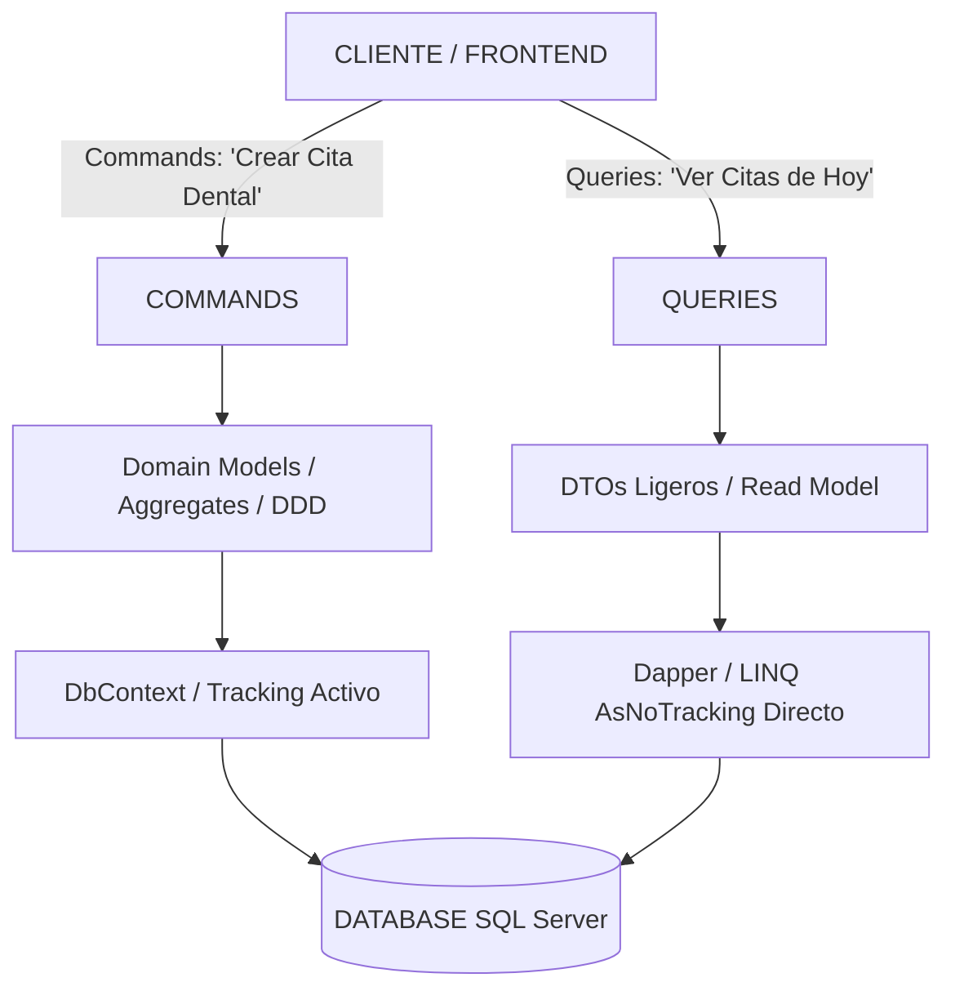
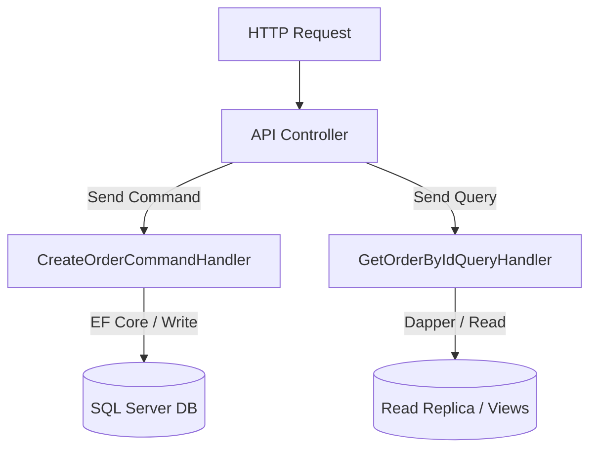

# 🔀 CQRS: Separación de Lecturas y Escrituras (Read/Write Separation)

**Dominio de referencia:** Dental Clinic (Appointments, Patients, Billing)

---

## 1. ¿Qué es CQRS y qué problema resuelve?

En arquitecturas CRUD tradicionales, se utiliza el **mismo modelo de datos y las mismas entidades** tanto para modificar información (Crear/Editar/Eliminar) como para consultar información (Listar/Buscar/Reportes).

### ❌ El problema del modelo único (Single Data Model)

En la Clínica Dental, imagina la entidad `Appointment` (Cita):

- **Para escribir (Escritura / Command):** Necesitas validar reglas de negocio complejas (si el horario del dentista está disponible, si la sala dental está libre, si el estado del paciente lo permite, cargar la entidad con `.Include()`).
- **Para leer (Lectura / Query):** La pantalla de recepción solo necesita mostrar una tabla con: Hora | Nombre del Paciente | Nombre del Dentista | Estado.

Si usas el mismo modelo para ambos:

1. Las consultas terminan haciendo `SELECT * FROM Appointments JOIN Dentists JOIN Patients...` trayendo decenas de campos innecesarios, consumiendo CPU y memoria en la base de datos y en la RAM de la API.
2. Las escrituras se ralentizan porque las entidades están recargadas de lógica y DTOs de vista.
3. Imposibilidad de escalar independientemente: en la gran mayoría de aplicaciones médicas o empresariales, las lecturas superan a las escrituras en una proporción de 90 a 10 (o incluso 99 a 1).

---

## 2. El Principio Fundamental de CQRS

CQRS propone dividir la arquitectura en **dos caminos completamente separados**:





---

## 3. Nivel 1 de CQRS: Separación Lógica en el mismo Motor SQL (Enfoque Práctico)

No necesitas montar dos bases de datos distintas (como SQL + Mongo) para hacer CQRS. El 90% de los proyectos .NET implementan **CQRS Lógico** dentro de la misma base de datos relacional usando dos vías de código diferentes.

### A) El Lado de Escritura (Commands)

**Objetivo:** Garantizar la integridad de las reglas de negocio y las transacciones (ACID).

**Herramientas:** Modelos de Dominio ricos (Aggregates en DDD), EF Core con Change Tracking, `SaveChangesAsync()`.

```csharp
// 1. El Command: Representa la intención de modificar el estado
public record ScheduleAppointmentCommand(
    Guid PatientId,
    Guid DentistId,
    DateTime ScheduledTime,
    string Reason) : IRequest<Guid>;
```

```csharp
// 2. El Handler de Escritura: Utiliza el Dominio
public class ScheduleAppointmentCommandHandler : IRequestHandler<ScheduleAppointmentCommand, Guid>
{
    private readonly IPatientRepository _patientRepository;
    private readonly IDentistRepository _dentistRepository;
    private readonly IAppointmentRepository _appointmentRepository;

    public async Task<Guid> Handle(ScheduleAppointmentCommand command, CancellationToken ct)
    {
        // Valida que el dentista esté disponible
        var isOccupied = await _dentistRepository.IsOccupiedAsync(command.DentistId, command.ScheduledTime, ct);

        if (isOccupied)
            throw new DomainException("Dentist already has an appointment at this time.");

        // Crea el agregado de Cita usando reglas del dominio
        var appointment = Appointment.Create(
            command.PatientId,
            command.DentistId,
            command.ScheduledTime,
            command.Reason
        );

        await _appointmentRepository.AddAsync(appointment, ct);
        await _appointmentRepository.UnitOfWork.SaveChangesAsync(ct);

        return appointment.Id;
    }
}
```

### B) El Lado de Lectura (Queries)

**Objetivo:** Máxima velocidad, mínima latencia y cero consumo inútil de RAM.

**Herramientas:** DTOs inmutables (`record`), `.AsNoTracking()`, proyecciones directas SQL/LINQ con EF Core o Dapper.

**Regla de Oro:** No pasa por el Modelo de Dominio ni usa Repositorios.

```csharp
// 1. El DTO de Lectura (Model exacto para la vista)
public record DailyAppointmentListDto(
    Guid AppointmentId,
    string PatientFullName,
    string DentistFullName,
    DateTime ScheduledTime,
    string Status,
    string Reason);
```

```csharp
// 2. La Query: Petición de lectura pura
public record GetDailyAppointmentsQuery(DateTime Date) : IRequest<List<DailyAppointmentListDto>>;
```

```csharp
// 3. El Handler de Lectura: Consulta directa súper rápida
public class GetDailyAppointmentsQueryHandler : IRequestHandler<GetDailyAppointmentsQuery, List<DailyAppointmentListDto>>
{
    private readonly ApplicationDbContext _context; // O IDbConnection de Dapper

    public GetDailyAppointmentsQueryHandler(ApplicationDbContext context)
    {
        _context = context;
    }

    public async Task<List<DailyAppointmentListDto>> Handle(GetDailyAppointmentsQuery query, CancellationToken ct)
    {
        // Proyección directa a DTO en SQL Server sin instanciar Entidades de EF
        return await _context.Appointments
            .AsNoTracking() // Desactiva Change Tracker
            .Where(a => a.ScheduledTime.Date == query.Date.Date)
            .Select(a => new DailyAppointmentListDto(
                a.Id,
                a.Patient.Name.FirstName + " " + a.Patient.Name.LastName,
                "Dr. " + a.Dentist.Name.LastName,
                a.ScheduledTime,
                a.Status.ToString(),
                a.Reason
            ))
            .ToListAsync(ct);
    }
}
```

---

## ⚖️ Ventajas y Trade-offs de CQRS

| Criterio | Arquitectura CRUD Tradicional | CQRS Lógico (.NET) |
|---|---|---|
| Complejidad de Código | Baja (1 solo modelo y servicio por entidad) | Media (Separación en Commands, Queries, DTOs y Handlers) |
| Rendimiento de Lectura | Lento en consultas complejas (sobrecarga de ORM) | Ultra rápido (Proyección directa a DTO, `AsNoTracking` o Dapper) |
| Mantenibilidad | Se complica a medida que la vista requiere campos cruzados | Alta (Cambiar una pantalla de consulta no altera la lógica de negocio de escritura) |
| Escalabilidad | Escalas todo el monolito junto | Permite optimizar o indexar la BD en función de queries específicas |

> **Trade-off clave:** en dominios CRUD simples, CQRS puede ser **over-engineering**. Solo añade valor real cuando existe **asimetría clara entre cargas de lectura y escritura** (ver `07-Interview/00-InterviewAnswers-CheatSheet.md`).

---

## 🎤 Respuesta Senior (English)

> **Q:** *"What is CQRS and how do you implement it in .NET applications?"*
>
> **A:** "CQRS stands for Command Query Responsibility Segregation. It separates the code path for state-modifying operations (Commands) from data-reading operations (Queries). In my .NET projects, I usually implement **Logical CQRS** using MediatR. For Commands, I route execution through Rich Domain Models and Aggregates using EF Core with change tracking to enforce business invariants and transactional consistency. For Queries, I bypass domain models and repositories entirely. Instead, I query the database directly using EF Core with `.AsNoTracking()` and `.Select()` projections — or raw SQL via Dapper — mapping results directly into lightweight DTOs. This eliminates ORM overhead, optimizes SQL queries, and allows us to scale read and write throughput independently."

---

## 📝 Puntos clave para recordar

- CQRS separa Commands (escritura, dominio, tracking) de Queries (lectura, DTOs, `AsNoTracking`).
- El 90% de los casos usa CQRS Lógico sobre la misma base SQL, no dos bases.
- Queries no usan Repositorios ni el modelo de dominio.
- Es una herramienta, no una regla: evítalo en CRUD simples.
- MediatR es el vehículo habitual (Commands/Queries → Handlers).