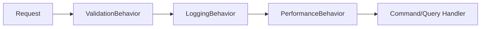

# 🔧 MediatR Pipeline Behaviors (Cross-Cutting Concerns)

**Dominio de referencia:** Dental Clinic (CQRS con MediatR)

---

## 🎯 Concepto

En arquitecturas basadas en CQRS y MediatR, los **Pipeline Behaviors** actúan como un *Middleware interno* para tus Commands y Queries. Permiten centralizar **lógica transversal** como:

- Validación (FluentValidation)
- Logging de Auditoría
- Manejo de Excepciones
- Métricas de Rendimiento

...sin ensuciar los Handlers.

---

## 💻 Ejemplo: Validation Pipeline Behavior con FluentValidation

```csharp
// Pipeline Behavior Genérico para Validación Transversal
public class ValidationBehavior<TRequest, TResponse> : IPipelineBehavior<TRequest, TResponse>
    where TRequest : IRequest<TResponse>
{
    private readonly IEnumerable<IValidator<TRequest>> _validators;

    public ValidationBehavior(IEnumerable<IValidator<TRequest>> validators)
    {
        _validators = validators;
    }

    public async Task<TResponse> Handle(TRequest request, RequestHandlerDelegate<TResponse> next, CancellationToken ct)
    {
        if (!_validators.Any()) return await next();

        var context = new ValidationContext<TRequest>(request);
        var failures = _validators
            .Select(v => v.Validate(context))
            .SelectMany(result => result.Errors)
            .Where(f => f != null)
            .ToList();

        if (failures.Count != 0)
            throw new ValidationException(failures);

        return await next(); // Continúa al Handler principal solo si la validación es exitosa
    }
}
```

Registro en `Program.cs`:

```csharp
builder.Services.AddTransient(typeof(IPipelineBehavior<,>), typeof(ValidationBehavior<,>));
```

---

## 📊 Diagrama del Pipeline



---

## 🎤 Respuesta Senior (English)

> **Q:** *"What are MediatR Pipeline Behaviors used for?"*
>
> **A:** "MediatR Pipeline Behaviors allow us to implement cross-cutting concerns like logging, performance monitoring, and validation centrally. By placing a `ValidationBehavior` using FluentValidation inside the MediatR pipeline, all Commands and Queries are automatically validated before hitting their respective Handlers, adhering strictly to the Single Responsibility Principle."

---

## 📝 Puntos clave para recordar

- Un Pipeline Behavior envuelve al Handler: corre **antes** (y opcionalmente después) de que el Handler ejecute.
- Centraliza validación, auditoría, excepciones y métricas sin duplicar código en cada Handler.
- Se registran por tipo genérico `IPipelineBehavior<,>` en el contenedor de DI.
- Es el mismo principio de *Middleware* de ASP.NET Core, pero a nivel de Commands/Queries.