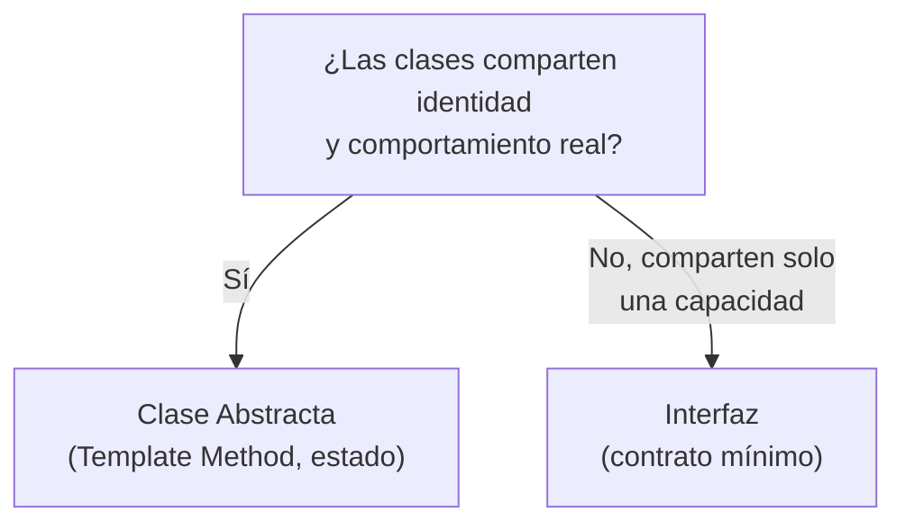
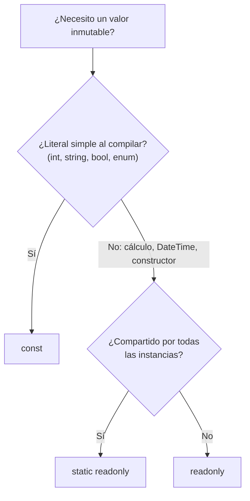
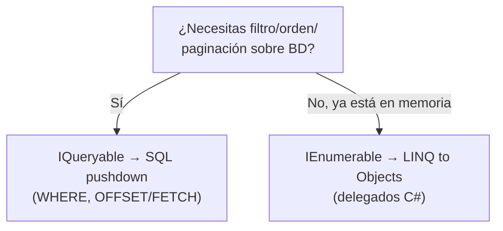
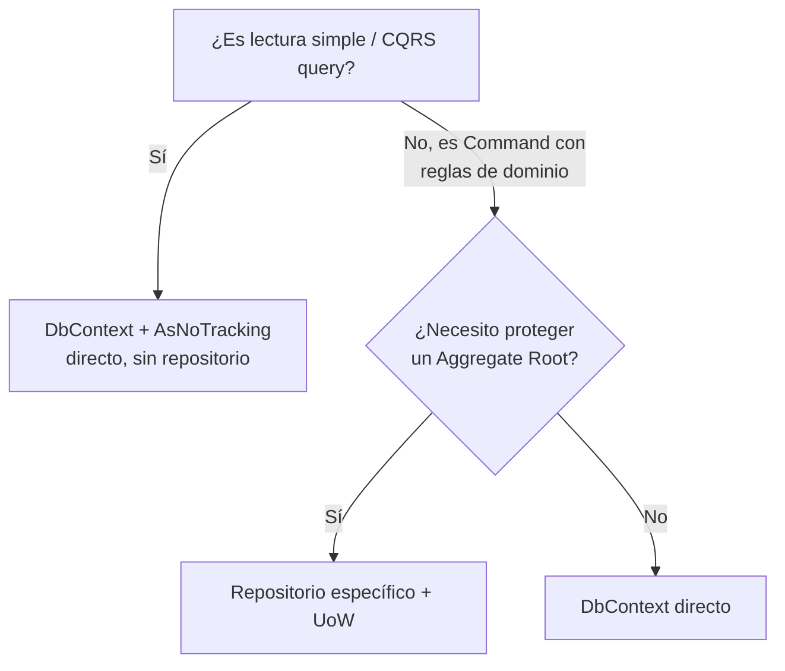

# 🎯 MASTER CHEAT SHEET — Examen Técnico .NET Senior

Concentrado visual de todos los temas del PlayBook para repaso rápido. Cada tema: **tabla + snippet clave + respuesta senior (EN)**. Detalle completo en el archivo de cada tema (enlaces al pie).

---

## 🧭 Mapa rápido de decisión

### Interface vs Abstract Class



### const vs readonly vs static readonly



### IQueryable vs IEnumerable



### Repository: ¿lo uso?



### CQRS: ¿Command o Query?

| Escritura (Command) | Lectura (Query) |
|---|---|
| Agregados + Change Tracking | `AsNoTracking()` + DTO |
| Repositorios de Aggregate | Dapper / proyección directa |
| `SaveChangesAsync()` | Nunca repositorios |

---

## 1. C# / OOP

### Interfaces vs Clases Abstractas

| | Interfaz | Clase Abstracta |
|---|---|---|
| Código real | ❌ (salvo default members) | ✅ Sí |
| Estado | ❌ | ✅ Sí |
| Cuántas | Ilimitadas | Solo 1 |
| Representa | "Puede hacer X" | "Es un tipo de X" |

> **Regla:** ¿Las clases son lo mismo con variaciones? → Abstracta. ¿Distintas pero necesitan hacer X? → Interfaz.

```csharp
public interface INotificationSender { Task SendAsync(Guid id, string msg, CancellationToken ct); }
// abstract = Template Method: método concreto orquesta, abstracto delega la variante.
```

> **Mocking:** con interfaz el dynamic proxy implementa libremente; sobre clase concreta solo si métodos son `virtual`/`abstract`. **Senior EN:** *"I choose based on relationship, not syntax — abstract for shared identity+behavior, interface for shared capability."*

### Virtual / Override vs Method Hiding (`new`)

| | `override` | `new` |
|---|---|---|
| Requiere `virtual` | ✅ Sí (si no → **CS0506**) | ❌ No |
| Polimorfismo runtime | ✅ Sí | ❌ Compile-time por tipo declarado |

> `Appointment a = new SurgeryAppointment(); a.CalculateCost();` → override=300, new=50. **Overload** ≠ herencia: se resuelve por firma en compilación.

### const vs readonly

| | `const` | `readonly` |
|---|---|---|
| Cuándo se fija | Compilación | Runtime (constructor) |
| Tipos | Literales primitivos | Cualquiera |
| Por instancia | Nunca | Sí |
| `DateTime` | ❌ nunca (`CS0133`) | ✅ `static readonly` |

### Func / Action / Predicate

| Delegado | Devuelve | Uso |
|---|---|---|
| `Action<T>` | void | callbacks, logging |
| `Func<T,TResult>` | valor | LINQ, cálculos |
| `Predicate<T>` | bool | filtros |

> Patrón: `Func<Task<T>>` envuelve ejecución en transacción/resilience (Polly).

**Fuentes:** `01-OOP-Fundamentals/01..07`

---

## 2. DDD

### Value Object vs Entity vs Aggregate Root

| Criterio | Value Object | Entity | Aggregate Root |
|---|---|---|---|
| Id | No | Sí único | Sí global |
| Igualdad | Por valor | Por Id | Por Id |
| Mutabilidad | Inmutable (`record`) | Mutable vía métodos | Mutable vía métodos |
| Acceso externo | Por copia | Solo vía Root | Vía Repositorios |

> **Regla de oro:** nada modifica entidades internas de un Agregado sin pasar por el Aggregate Root.

### Composition vs Inheritance (EF Core)

- ❌ `Person`/`IPerson` → **TPH** (columnas NULL) o **TPT** (JOINs costosos)
- ✅ Has-a: `Patient` TIENE UN `PersonName` + `ContactInfo` → `.ComplexProperty()` → tabla plana, cero JOINs, cero NULL

### Domain Events

- Se nombran en **tiempo pasado**: `ToothTreatmentAppliedDomainEvent` (no `CompleteAppointment`)
- Agregado registra el evento → `SaveChangesInterceptor` + **MediatR** lo despacha antes del commit
- In-Process (MediatR) vs Out-of-Process (Integration Events / broker)

> **Senior EN:** *"The aggregate only records the event; an EF Core interceptor publishes it via MediatR right before SaveChangesAsync — keeping the aggregate decoupled from billing, email, inventory."*

**Fuentes:** `02-DDD/01..03`

---

## 3. EF Core & Performance

### N+1: las 3 estrategias

| | Lazy Loading ❌ | Eager (`.Include`) 🟡 | DTO (`.Select`) 🟢 |
|---|---|---|---|
| SQL | 1 + N | 1 | 1 |
| Hops de red | N+1 | 1 | 1 |
| Change Tracker | Sí | Sí | No (`AsNoTracking`) |

> **Prevención:** desactivar Lazy Loading (`ChangeTracker.LazyLoadingEnabled = false`) para fallar rápido en tests; proyectar a DTO con `AsNoTracking().Select()`.

### IQueryable vs IEnumerable

- **IQueryable** = Expression Tree → se traduce a **1 SQL** en el servidor (pushdown)
- **IEnumerable** = delegados C# → filtra en RAM (trae TODA la tabla: `OutOfMemoryException`)

```csharp
// ❌ var all = await ctx.Patients.ToListAsync(); all.Where(...).Skip(10).Take(10);
// ✅ ctx.Patients.AsNoTracking().Where(...).Skip(10).Take(10).Select(...)
```

### Transacciones

- `DbContext` = Unit of Work nativo: **1 `SaveChangesAsync()` = 1 transacción atómica** (Change Tracker)
- Múltiples `SaveChangesAsync` / stored procedures → `BeginTransactionAsync()` explícita

**Fuentes:** `03-EFCore-Performance/01..02`

---

## 4. Arquitectura

### SOLID (1 línea)

| | Principio |
|---|---|
| **S** | Una razón para cambiar |
| **O** | Abierto a extensión, cerrado a modificación |
| **L** | Subtipos sustituibles sin alterar comportamiento |
| **I** | Interfaces pequeñas y específicas |
| **D** | Depende de abstracciones, no de concreciones |

### Clean Architecture

> Las dependencias apuntan **hacia adentro**: `Domain ← Application ← Infrastructure / WebApi`. El dominio no conoce ORMs ni frameworks.

### DI Lifetimes

| | Instancia | Cuidado |
|---|---|---|
| Transient | Cada vez | Servicios ligeros sin estado |
| Scoped | Por request | **DbContext** estándar |
| Singleton | Única global | **Captive Dependency**: Singleton→Scoped = leak + thread-safety |

> **Senior EN (Captive Dependency):** *"A Singleton holding a Scoped service like DbContext keeps it alive indefinitely — I use IServiceScopeFactory to create an explicit scope inside the Singleton."*

**Fuentes:** `04-Architecture/01..05`

---

## 5. Patterns

### Repository & Unit of Work

- `DbSet` ya es Repository; `DbContext` ya es UoW en EF Core
- ❌ **Anti-patrón:** `GenericRepository<T>` (Leaky Abstraction) rompe `IQueryable`, `.Select()` y `AsNoTracking()`
- ✅ Lectura/CQRS: sin repositorios. Escritura: repositorios específicos solo para proteger Aggregate Roots
- 🚩 Red flags: `SaveChanges()` por método de repo; exponer `IQueryable` al controller; "cambiar de BD mañana"

### CQRS

| Command | Query |
|---|---|
| Dominio rico + tracking | DTO + `AsNoTracking()`/Dapper |
| Atomicidad (UoW, 1 Agregado) | Sin dominio ni repositorios |

> **Cuándo NO:** CRUD simple → over-engineering. **Cuándo SÍ:** asimetría clara lectura/escritura (90/10).

### MediatR Pipeline Behaviors

> Middleware interno para Commands/Queries: validación (FluentValidation), logging, métricas — centralizado, sin ensuciar Handlers.

### Event Sourcing

- **Persistencia** (no es arquitectura): append-only log de eventos inmutables
- **Snapshots** cada N eventos → hidratación rápida
- **Upcasters** → migrar payloads viejos sin mutar eventos
- Combinado con CQRS: Write (Event Store) + Read (Projections), consistencia eventual

**Fuentes:** `04-Architecture/04..05`, `05-Patterns-CQRS/01..04`

---

## 6. Microservices

- **Database per Service:** cada servicio es dueño absoluto de sus datos; interacción solo por API/eventos
- **Saga** (sin ACID distribuido):

| | Coreografía | Orquestación |
|---|---|---|
| Mecanismo | Eventos entre servicios | Orquestador central |
| Acoplamiento | Muy bajo | Moderado |
| Uso | 2-3 pasos simples | Flujos complejos con compensaciones |

- Implementación: **MassTransit State Machines** + RabbitMQ/Service Bus
- **Outbox Pattern:** evento guardado con el cambio de estado + worker → no se pierde nada (at-least-once + idempotencia)

**Fuente:** `06-Microservices/01`

---

## 7. Async & Caching

### Async / Await

- **I/O-bound** (BD, red) → `async/await` (libera el hilo al Thread Pool)
- **CPU-bound** → `Task.Run()` en hilo secundario
- 🚩 Nunca `.Result`/`.Wait()` → Thread Starvation/Deadlocks
- Siempre propaga `CancellationToken`

### Redis vs MemoryCache

| | IMemoryCache (local) | Redis (distribuido) |
|---|---|---|
| Ubicación | RAM del proceso | Servidor dedicado |
| Escala | 1 pod | N pods/instancias |
| Estado | Desincronizado | Único y consistente |

### Cache-Aside (estándar)

1. Buscar en caché → **Hit**: devolver
2. **Miss**: leer BD → guardar en Redis con TTL → devolver

> Invalidación: eventos en escrituras borran la clave (Cache Eviction). TTL: Absolute vs Sliding.

**Fuente:** `05-Patterns-CQRS/05`

---

## ⚡ 8. Big O Notation

Mide **cómo crece el tiempo (o memoria)** cuando crece la entrada *n*. Solo importa el **término dominante**: `O(2n + 5) = O(n)`.

### Clases de complejidad

| Clase | Nombre | Ejemplo C# | Intuición |
|---|---|---|---|
| `O(1)` | Constante | `dict[key]`, acceso por índice `arr[i]` | Siempre el mismo costo |
| `O(log n)` | Logarítmica | Búsqueda binaria, `SortedSet`/`BinarySearch` | Divide y vencerás |
| `O(n)` | Lineal | `foreach`, `list.Contains` (List), `string.Contains` | Recorre una vez |
| `O(n log n)` | Lineal-log | `OrderBy` (MergeSort/QuickSort), `distinct` ordenado | Divide y recorre |
| `O(n²)` | Cuadrática | Bucles anidados, Bubble Sort | Doble recorrido |
| `O(2^n)` | Exponencial | Fibonacci recursivo sin memo | Cada paso duplica |

```csharp
// O(n) — una pasada
var total = 0;
foreach (var x in list) total += x;

// O(n²) — bucles anidados (comparar pares)
for (int i = 0; i < n; i++)
    for (int j = 0; j < n; j++) { /* ... */ }

// O(log n) — divide a la mitad
int BinarySearch(int[] a, int v) { int lo=0, hi=a.Length-1;
    while (lo <= hi) { int mid = (lo+hi)/2;
        if (a[mid] < v) lo = mid+1; else if (a[mid] > v) hi = mid-1; else return mid; }
    return -1; }
```

### Complejidad de operaciones por estructura

| Estructura (.NET) | Acceso | Búsqueda | Inserción | Eliminación |
|---|---|---|---|---|
| `Array` | `O(1)` | `O(n)` | `O(n)` (redimensionar) | `O(n)` |
| `List<T>` | `O(1)` por índice | `O(n)` (`Contains`) | `Add` O(1) amortizado; insert medio `O(n)` | `Remove` `O(n)` |
| `LinkedList<T>` | `O(n)` | `O(n)` | `O(1)` al inicio/fin | `O(1)` con nodo |
| `Dictionary<K,V>` | `O(1)` por key | `O(1)` | `O(1)` promedio | `O(1)` promedio |
| `HashSet<T>` | — | `O(1)` | `O(1)` promedio | `O(1)` promedio |
| `Stack<T>` / `Queue<T>` | top/front `O(1)` | `O(n)` | `O(1)` | `O(1)` |
| `SortedSet<T>` / `SortedList` | `O(log n)` | `O(log n)` | `O(log n)` | `O(log n)` |
| `PriorityQueue<T>` (heap) | `O(1)` peek | — | `O(log n)` | `O(log n)` pop |

### Algoritmos de ordenamiento

| Algoritmo | Mejor | Promedio | Peor | Estable |
|---|---|---|---|---|
| Bubble / Insertion | `O(n)` | `O(n²)` | `O(n²)` | Sí |
| QuickSort | `O(n log n)` | `O(n log n)` | `O(n²)` | No |
| MergeSort | `O(n log n)` | `O(n log n)` | `O(n log n)` | Sí |
| HeapSort | `O(n log n)` | `O(n log n)` | `O(n log n)` | No |

**Búsqueda:** Lineal `O(n)` · Binaria `O(log n)` (requiere orden previo `O(n log n)`).

### Costos típicos en LINQ / colecciones

| Operación | Costo |
|---|---|
| `First()` / `FirstOrDefault()` | `O(n)` peor caso (O(1) si cumple pronto) |
| `Last()` sobre List | `O(1)` por índice; sobre IEnumerable `O(n)` |
| `Single()` / `SingleOrDefault()` | `O(n)` (valida unicidad) |
| `Where()` / `Select()` | `O(n)` (deferred — no ejecuta hasta materializar) |
| `Any()` | `O(1)` si hay al menos uno |
| `Contains()` en List | `O(n)` → usar `HashSet` para `O(1)` |
| `Distinct()` | `O(n)` (usa hash) |
| `OrderBy()` | `O(n log n)` |
| `GroupBy()` | `O(n)` |
| `Count()` sobre List | `O(1)`; sobre IEnumerable `O(n)` |
| `ToDictionary()` / `ToHashSet()` | `O(n)` |
| `.Where().First()` | `O(k)` con k = posición del primer match |

> **Regla:** para membresía/unicidad usa `HashSet`/`Dictionary` (`O(1)`) en vez de `List.Contains` (`O(n)`). Evita `Single` cuando `First` basta.

---

## 🏁 Respuestas clave (English one-liners)

| # | Pregunta | One-liner | Detalle |
|---|---|---|---|
| 1 | Interface vs Abstract Class | *"Abstract for shared identity+behavior; interface for shared capability across unrelated classes."* | `01-OOP-Fundamentals/03` |
| 2 | Why interfaces enable mocking | *"Mocking generates dynamic proxies — they implement any interface but can't override non-virtual methods."* | `01-OOP-Fundamentals/01` |
| 3 | const DateTime | *"const requires compile-time literals; DateTime needs runtime construction → static readonly."* | `01-OOP-Fundamentals/05` |
| 4 | Override vs `new` | *"override = runtime polymorphism; new = method hiding, resolves by declared type."* | `01-OOP-Fundamentals/04` |
| 5 | Entity vs Value Object vs Aggregate | *"VO = value equality, no Id; Entity = stable Id; Aggregate Root = gateway enforcing invariants."* | `02-DDD/02` |
| 6 | Why no shared Person base | *"TPH fills NULLs, TPT forces JOINs; composition with Value Objects keeps schema flat."* | `02-DDD/01` |
| 7 | Domain Events dispatch | *"Aggregate records the event; an EF Core interceptor publishes via MediatR before commit."* | `02-DDD/03` |
| 8 | N+1 prevention | *"DTO projections with Select + AsNoTracking, disable Lazy Loading to fail fast."* | `03-EFCore-Performance/01` |
| 9 | IQueryable vs IEnumerable | *"IQueryable pushes SQL pushdown (WHERE/OFFSET); IEnumerable filters in RAM."* | `03-EFCore-Performance/02` |
| 10 | SOLID in practice | *"SRP thin handlers, DIP via DI, ISP small contracts — swapable and testable."* | `04-Architecture/01` |
| 11 | Clean Architecture | *"Dependencies point inward; Domain is the isolated core, ORMs are infrastructure details."* | `04-Architecture/02` |
| 12 | Captive Dependency | *"Singleton holding Scoped DbContext leaks memory — use IServiceScopeFactory."* | `04-Architecture/03` |
| 13 | Repository redundancy | *"DbSet/DbContext already implement it; add repositories only for Aggregate Root protection."* | `04-Architecture/04` |
| 14 | Unit of Work | *"DbContext Change Tracker wraps all pending writes in one atomic transaction at SaveChangesAsync."* | `04-Architecture/05` |
| 15 | CQRS value | *"Real value with read/write asymmetry; over-engineering for simple CRUD."* | `05-Patterns-CQRS/01` |
| 16 | MediatR Behaviors | *"Cross-cutting concerns (validation/logging) run centrally before handlers."* | `05-Patterns-CQRS/02` |
| 17 | Event Sourcing needed? | *"No — CQRS runs on relational DB; ES only when audit trails are core."* | `05-Patterns-CQRS/03` |
| 18 | Distributed transactions | *"Saga with compensating transactions via MassTransit state machines."* | `06-Microservices/01` |
| 19 | async/await | *"Releases the thread for I/O-bound work; never .Result/.Wait."* | `05-Patterns-CQRS/05` |
| 20 | Redis caching | *"Cache-Aside with TTL; invalidate on writes via domain events."* | `05-Patterns-CQRS/05` |

---

## 🔗 Fuentes completas

| Módulo | Archivos |
|---|---|
| C#/OOP | `01-OOP-Fundamentals/01` … `07` |
| DDD | `02-DDD/01` … `03` |
| EF Core | `03-EFCore-Performance/01`, `02` |
| Arquitectura | `04-Architecture/01` … `05` |
| Patterns/CQRS | `05-Patterns-CQRS/01` … `05` |
| Microservices | `06-Microservices/01` |
| Entrevistas | `07-Interview/00` (cheatsheet Q&A), `01` (pitch sheet) |
| Dashboard | `README.md` |