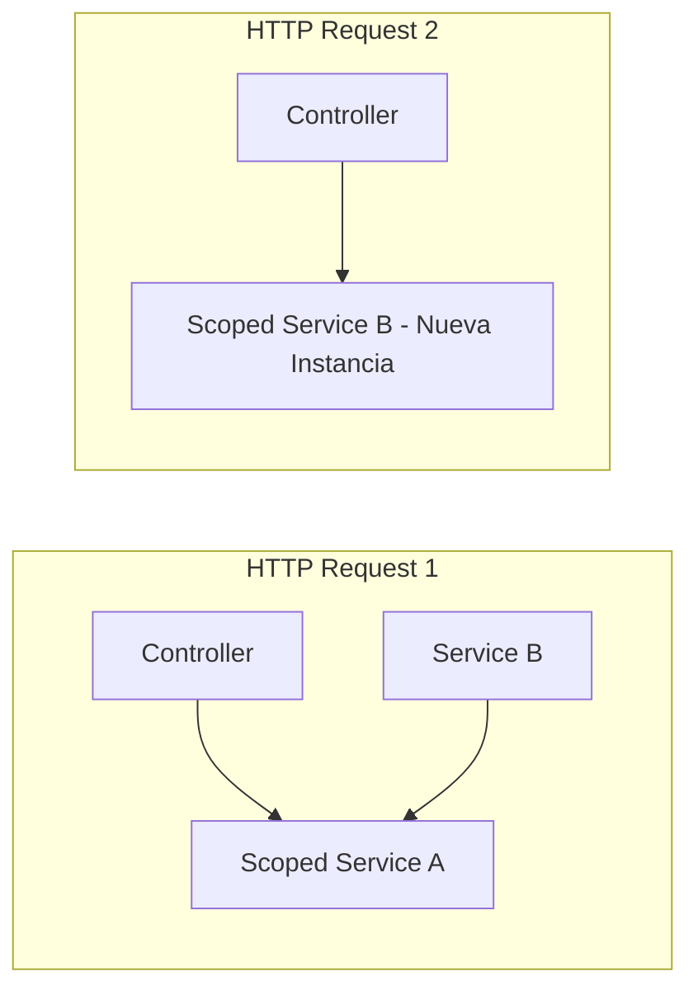

# 01-Architecture / Dependency Injection & Lifetimes

---

## 1. ¿Qué problema resuelve?

Elimina el acoplamiento directo entre clases (`new Class()`), permitiendo inyectar dependencias externamente para mejorar la testabilidad, modularidad y gestión del ciclo de vida de los objetos en memoria.

---

## 2. Service Lifetimes en .NET Core

- **Transient:** Se crea una nueva instancia cada vez que se solicita. Ideal para servicios ligeros y sin estado (Stateless).
- **Scoped:** Se crea una instancia por cada petición HTTP (Request). Es el lifetime estándar para `DbContext` de Entity Framework.
- **Singleton:** Se crea una única instancia para toda la vida de la aplicación. Cuidado con Captive Dependencies y Thread Safety.

---

## 3. Diagrama (Mermaid)



---

## 4. Ejemplo de Código en C#

```csharp
var builder = WebApplication.CreateBuilder(args);

// Registro de servicios según lifetime
builder.Services.AddTransient<ITokenGenerator, JwtTokenGenerator>();
builder.Services.AddScoped<IOrderRepository, OrderRepository>();
builder.Services.AddSingleton<ICacheService, RedisCacheService>();
```

---

## 5. 🎤 Respuesta de Entrevista en Inglés (Senior/Staff Level)

> **Interviewer:** *"What is a Captive Dependency and how do you avoid it in .NET?"*

> **Your Answer:**  
> "A Captive Dependency occurs when a service with a longer lifetime holds onto a service with a shorter lifetime—for example, when a **Singleton** service injects a **Scoped** service like `DbContext`. This keeps the scoped object alive indefinitely, leading to memory leaks and thread-safety bugs. To avoid this, I use the `IServiceScopeFactory` to explicitly create a scope inside the Singleton when I need to interact with scoped resources."