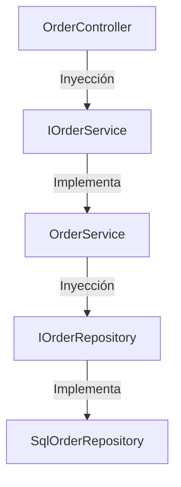

# 01-Architecture / SOLID Principles

---

## 1. ¿Qué problema resuelve?

Evita el código frágil, rígido y difícil de testear. Garantiza que el software sea extensible sin romper funcionalidades existentes.

---

## 2. Los 5 Principios

- **SRP (Single Responsibility):** Una clase debe tener una sola razón para cambiar.
- **OCP (Open/Closed):** Abierto para extensión, cerrado para modificación.
- **LSP (Liskov Substitution):** Subclases deben poder reemplazar a sus clases base sin alterar el comportamiento.
- **ISP (Interface Segregation):** Interfaces específicas en lugar de interfaces gigantes de propósito general.
- **DIP (Dependency Inversion):** Módulos de alto nivel no deben depender de módulos de bajo nivel; ambos dependen de abstracciones.

---

## 3. Diagrama de Arquitectura (Mermaid)



---

## 4. Ejemplo en C# (.NET 8)

```csharp
// BAD: Rompe SRP e ISP
public interface IOrderProcessor 
{
    void ProcessOrder(Order order);
    void SaveToDatabase(Order order);
    void SendEmailNotification(Order order);
}

// GOOD: Respetando SRP, ISP y DIP
public interface IOrderProcessor 
{
    Task ProcessAsync(Order order);
}

public interface IOrderRepository 
{
    Task SaveAsync(Order order);
}

public interface INotificationService 
{
    Task SendConfirmationAsync(Order order);
}
```

---

## 5. 🎤 Respuesta de Entrevista en Inglés (Senior/Staff Level)

> **Interviewer:** *"How do you apply SOLID principles in your day-to-day .NET architecture?"*

> **Your Answer:**  
> "In my daily workflow, SOLID principles are key to maintaining a clean and testable codebase. For instance, I enforce **SRP** by keeping controllers and command handlers thin, delegating business rules to domain services or aggregates. I rely heavily on **DIP** through Dependency Injection, allowing us to swap persistence implementations—like switching from EF Core to Dapper for performance-critical queries—without touching core business logic. Finally, I apply **ISP** to design small, focused contracts that make unit testing with mocks straightforward and resilient to breaking changes."