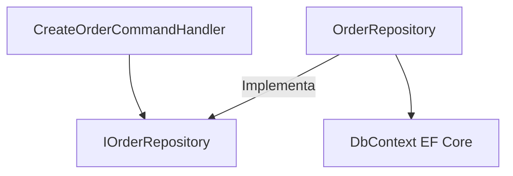

# 03-Patterns / Repository Pattern

---

## 1. ¿Por qué el Repository Pattern?

Abstrae el acceso a datos del resto de la aplicación, imitando una colección en memoria de objetos de dominio.

---

## 2. Diagrama (Mermaid)



---

## 3. Código C# (.NET 8)

```csharp
public interface IOrderRepository
{
    Task<Order?> GetByIdAsync(Guid id);
    Task AddAsync(Order order);
}

public class OrderRepository : IOrderRepository
{
    private readonly ApplicationDbContext _context;

    public OrderRepository(ApplicationDbContext context)
    {
        _context = context;
    }

    public async Task<Order?> GetByIdAsync(Guid id) => 
        await _context.Orders.FindAsync(id);

    public async Task AddAsync(Order order) => 
        await _context.Orders.AddAsync(order);
}
```

---

## 4. 🎤 Respuesta de Entrevista en Inglés (Senior/Staff Level)

> **Interviewer:** *"Since EF Core already implements DbSet as a Repository, isn't adding another Repository layer redundant?"*

> **Your Answer:**  
> "It depends on the complexity of the domain. While `DbContext` and `DbSet` already implement Unit of Work and Repository patterns, introducing an explicit repository in Clean Architecture prevents EF Core primitives—like `IQueryable`—from leaking into application handlers or controllers. It establishes a clear boundary for pure domain entities and simplifies unit testing with mocks. However, for read-heavy or simple CQRS queries, bypassing custom repositories and querying EF Core or Dapper directly is often a pragmatic, high-performance trade-off."